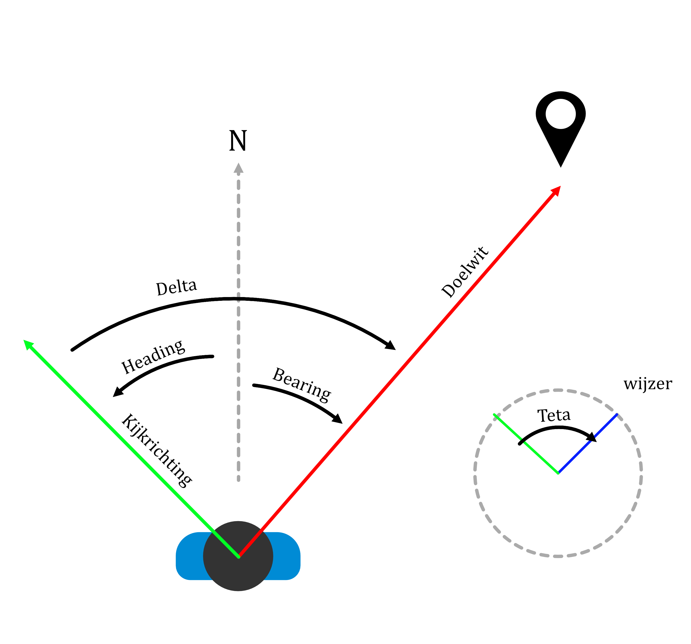
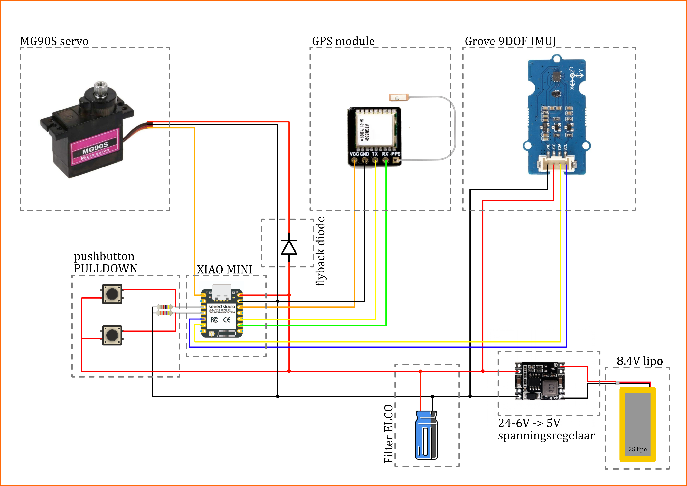

# Opkomende Technologieën
## Inleiding
In kader van het vak opkomende technologieën (OT) werken we een MVP variant uit van de SHERPA wegwijzer uit project gebruiksgericht ontwerpen (GGO). in het vak OT is de onderbouwing uit GGO minder van toepassing. De nadruk ligt op het uitwerken van een technisch uitdagend prototype waarbij verschillende competenties worden getoest en samenkomen.
### GGO
---
Het product en doelstellingen uit GGO zien er als volgt uit:

**Product:** Navigatiehulpmiddel voor blinden en slechtzienden

**Doel:**
Gebruikers een manier geven om sneller en zelfstandiger onbekende routes aan te leren en onderhouden.

Productdoelstellingen:
1. Gebruikers kunnen een traject zelfstandig afleggen zonder hulp van derden  
2. Gebruikers kunnen met hulp van derden trajecten opnemen  
3. Gebruikers ervaren continu oriëntatie en vertrouwen tijdens het gebruik  
4. Gebruikers blijven fysiek veilig tijdens navigatie  
5. Het systeem vereist minimale training en mentale inspanning

  

Dit heeft zich kortweg vertaald naar een mobiel navigatiesyteem dat met een wijzer de weg wijst doorheen een opgenomen traject. Op deze wijze wordt een blinde van punt naar punt doorheen de veiligste weg geleid. Hierover valt uitgebreid te lezen in GGO portie van deze github.

### Opdracht
---

Voor OT kijken we naar de technische uitdagingen. Dit zijn volgende punten:

- Waar is de persoon: GPS data uitlezen intepreteren en gebruiken.

- Traject opslaan: Data opslaan en opnieuw ophalen.

- Naar waar kijkt de persoon: Kijkrichting van de gebruiker bepalen met een IMU.

- Wijzer richten: Servo aansturen zodat deze altijd naar het volgende waypoint wijst.

- Algemene besturing van toestel: Inputs toevoegen zodat de gebruiker het toestel kan gebruiken.

- Op afstand het systeem uitlezen en de data weergeven op een HMI: Connectiviteit wifi/bluethoot, dashbord waar data weergegeven wordt om troubleshooting te bevorderen.

### IMU
#### Concept
De wijzer moet het volgende waypoint aanwijzen. Hier is de vraag: Hoe weet de wijzer naar waar hij moet wijzen? Volgende afbeelding illustreert hoe de hoek bepaald wordt. Het magnetisch noorder dient als nullijn. wijzersin loopt de hoek van 0 tot 360 graden op. Soms komt [0,180] en [-180,0] voor in de berekeningen. Onthoud dat de heading en bearing altijd genormaliseerd worden naar een waarde tussen de 0 en 360 graden. Het verschil tussen de heading en bearing noemen we delta. Met delta kan teta gevonden worden. Teta stuurt de hoek van de servo.

  

#### Onderdelen en schakeling
We maken gebruik van een grove 9dof IMU. Deze sensor bevat een accelerometer, gyrometer en magnetometer. 
#### IMU uitlezen
De meegeleverde voorbeeld code uit de bibliotheek is onbruikbaar, deze bevat geen tilt compensatie en sensor fusion. Volgdende instructables post gebruiken we als basis om onze sensoren uit te lezen en om te zetten in nuttige informatie

>https://www.instructables.com/Tilt-Compensated-Compass/

  

