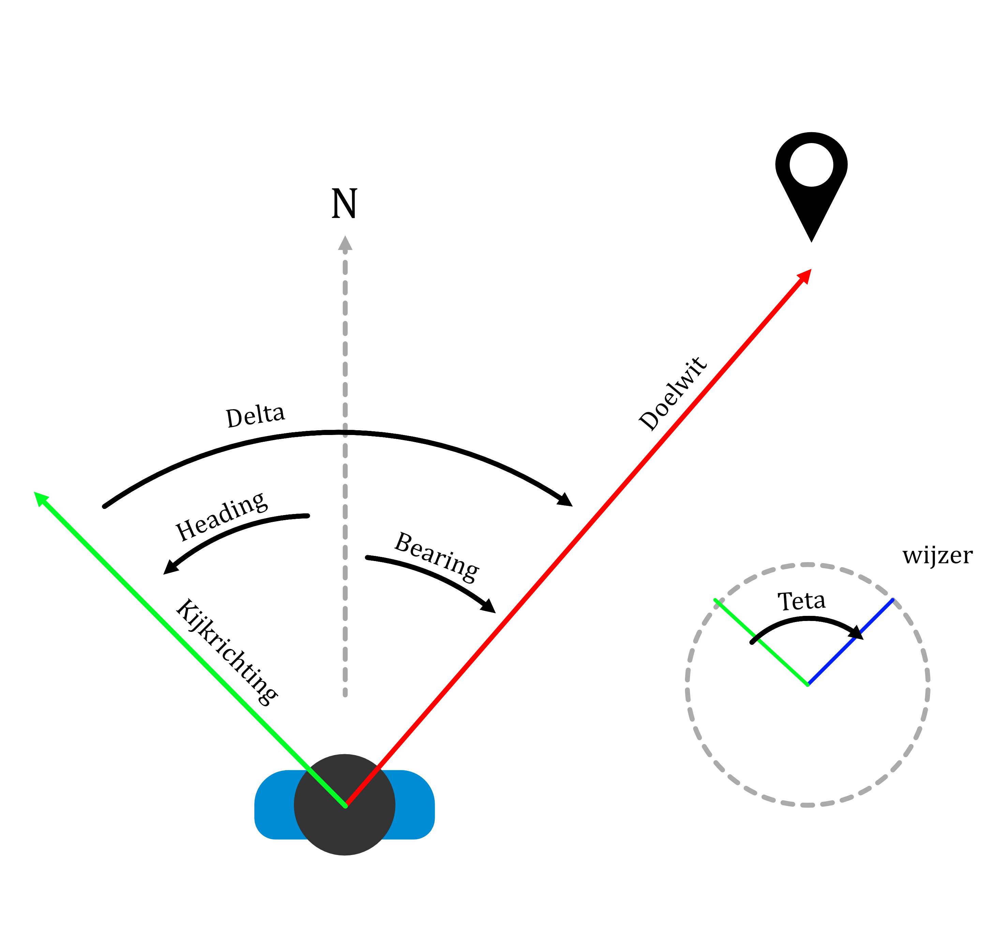
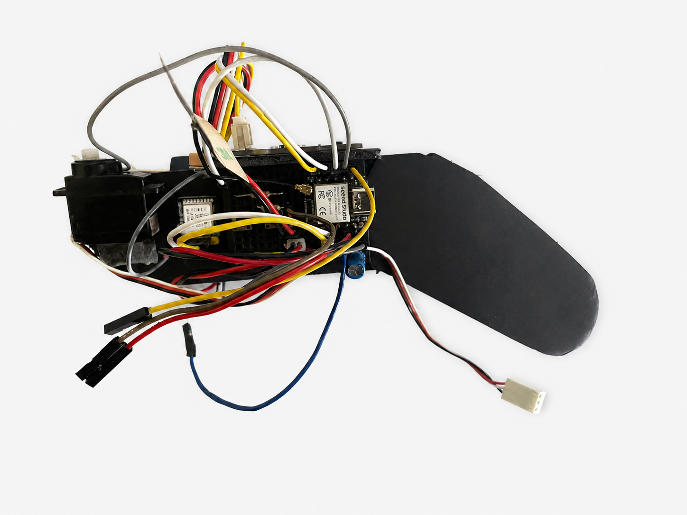
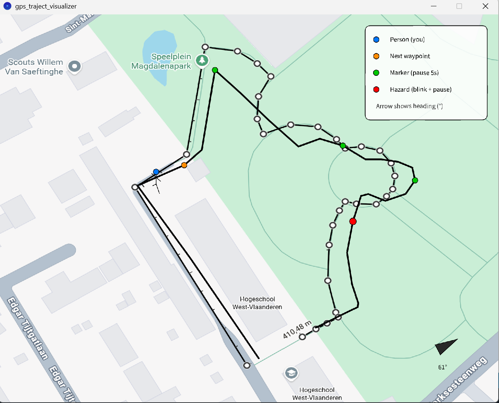
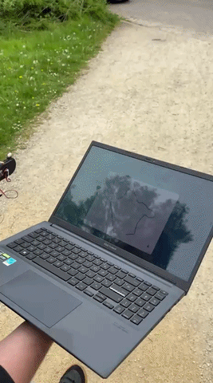

# Opkomende Technologieën
## Inleiding
In kader van het vak opkomende technologieën (OT) werken we een MVP variant uit van de SHERPA wegwijzer uit project gebruiksgericht ontwerpen (GGO). in het vak OT is de onderbouwing uit GGO minder van toepassing. De nadruk ligt op het uitwerken van een technisch uitdagend prototype waarbij verschillende competenties worden getoest en samenkomen.
### GGO
---
Het product en doelstellingen uit GGO zien er als volgt uit:

**Product:** Navigatiehulpmiddel voor blinden en slechtzienden

**Doel:**
Gebruikers een manier geven om sneller en zelfstandiger onbekende routes aan te leren en onderhouden.

Productdoelstellingen:
1. Gebruikers kunnen een traject zelfstandig afleggen zonder hulp van derden  
2. Gebruikers kunnen met hulp van derden trajecten opnemen  
3. Gebruikers ervaren continu oriëntatie en vertrouwen tijdens het gebruik  
4. Gebruikers blijven fysiek veilig tijdens navigatie  
5. Het systeem vereist minimale training en mentale inspanning

  

Dit heeft zich kortweg vertaald naar een mobiel navigatiesyteem dat met een wijzer de weg wijst doorheen een opgenomen traject. Op deze wijze wordt een blinde van punt naar punt doorheen de veiligste weg geleid. Hierover valt uitgebreid te lezen in GGO portie van deze github.

## Opdracht
---

Voor OT kijken we naar de technische uitdagingen. Dit zijn volgende punten:

- Waar is de persoon: GPS data uitlezen intepreteren en gebruiken.

- Traject opslaan: Data opslaan en opnieuw ophalen.

- Naar waar kijkt de persoon: Kijkrichting van de gebruiker bepalen met een IMU.

- Wijzer richten: Servo aansturen zodat deze altijd naar het volgende waypoint wijst.

- Algemene besturing van toestel: Inputs toevoegen zodat de gebruiker het toestel kan gebruiken.

- Op afstand het systeem uitlezen en de data weergeven op een HMI: Connectiviteit wifi/bluethoot, dashbord waar data weergegeven wordt om troubleshooting te bevorderen.

### Richtingbepaling
---
Doel

De wijzer moet het volgende waypoint aanwijzen. Hier is de vraag: Hoe weet de wijzer naar waar hij moet wijzen? Volgende afbeelding illustreert hoe de hoek bepaald wordt. Het magnetisch noorder dient als nullijn. wijzersin loopt de hoek van 0 tot 360 graden op. Soms komt [0,180] en [-180,0] voor in de berekeningen. Onthoud dat de heading en bearing altijd genormaliseerd worden naar een waarde tussen de 0 en 360 graden. Het verschil tussen de heading en bearing noemen we delta. Met delta kan teta gevonden worden. Teta stuurt de hoek van de servo.

Met een IMU bepalen we de heading. De bearing bepaling we aan de hand van de huidige locatie en het doelwit. De huidige locatie halen we op met een gps. Het doelwit is een van de opgeslagen coordinaten.

  

#### IMU
We maken gebruik van een grove 9dof IMU. Deze sensor bevat een accelerometer, gyrometer en magnetometer. 

De meegeleverde voorbeeld code uit de bibliotheek is onbruikbaar, deze bevat geen tilt compensatie en sensor fusion. Volgdende instructables post gebruiken we als basis om onze sensoren uit te lezen en om te zetten in nuttige stabiele informatie.

>https://www.instructables.com/Tilt-Compensated-Compass/

#### GPS
De gps is in staat om binnen de 2 meter zijn positie te bepalen. Dit coordinaat update constant. De bibliotheek TinyGPS++ bevat een bearing functie die bij ingave van twee coordinaten de bearing teruggeeft.

#### Inputs en outputs
De gebruiker bestuurd het toestel met 2 knoppen. De knoppen zijn NO drukknopjes. We verbinden ze met pulldown weerstanden aan de microcontroller. 
Het toestel bevat ook een trilmotor voor vibratiefeedback. De trilmotor wordt aangestuurd met een pwm signaal. Dit maakt het mogelijk om verschillende patronen af te spelen.

## Onderdelen en schakeling
---
Volgende afbeelding toont de schakeling schematisch weer.

  

Dit schema uitgewerkt in een eerste versie ziet er chaotisch uit. Maar alles is aanwezig om de functionaliteit te testen. Hierna kan de geteste en werkende versie in een afgewerkte omhuizing worden gestoken.

  

## Visualiseren van het traject
---

  

In de eerste fase van het project werd een visualisatie ontwikkeld in Processing. Hierbij werden GPS-datapunten handmatig geëxtraheerd uit Google Maps en ingelezen om het traject statisch uit te tekenen. 

Omdat de ESP-32 fungeert als een lokale webserver en continu live-coördinaten doorstuurt, zijn we voor de definitieve opstelling overgestapt naar een dynamische, webgebaseerde (HTML) visualisatie. Dit maakt het mogelijk om de ontvangen data veel efficiënter en in real-time weer te geven.

## Validatietest
---
Om de effectiviteit, integratie en nauwkeurigheid van het systeem in de praktijk te verifiëren, is het traject fysiek afgelegd tijdens een veldtest. 
De eerste GIF demonstreert de dynamische werking van de wijzer. Deze past zich real-time aan op basis van de actuele kijkrichting (heading) van het toestel ten opzichte van het volgende waypoint.

  

De tweede GIF toont de navigatie door een scherpe bocht. Hierbij is te zien hoe de binnenkomende data van de ESP-32 nauwkeurig wordt geregistreerd op het webdashboard, terwijl de fysieke wijzer synchroon en correct het volgende waypoint aanduidt.

  

### Noot inzake het gebruik van AI
---
In dit project werd Gemini Pro gebruikt bij het coderen van de visualisatie, zowel voor Processing als voor de finale HTML-website. Ook werd de tekst grammaticaal scherpgesteld door Gemini.