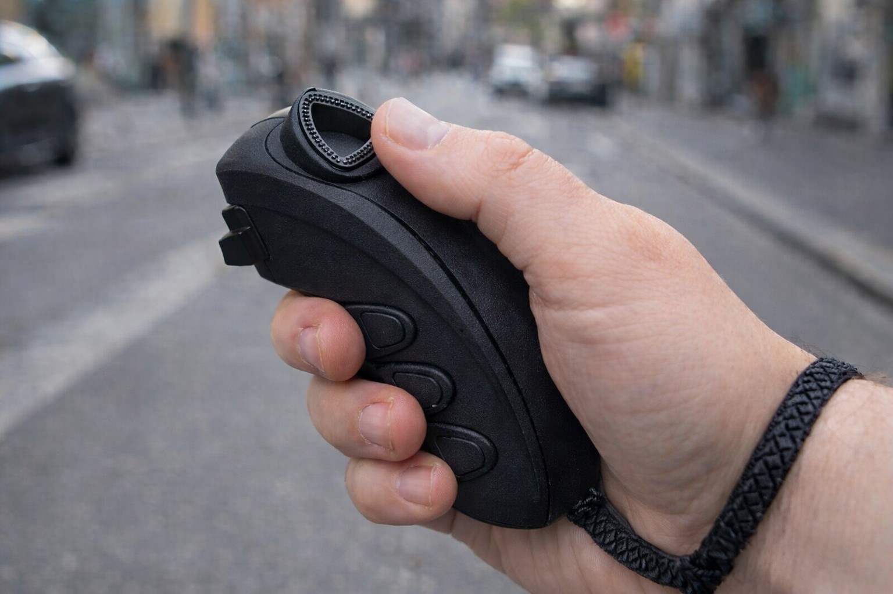
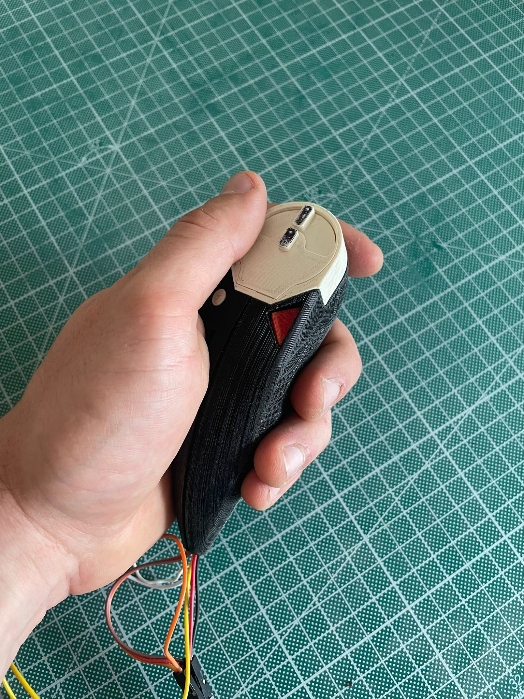

# Opkomende Technologieën
## Inleiding
In het kader van het vak Opkomende Technologieën (OT) werken we een MVP-variant uit van de SHERPA-wegwijzer uit het project Gebruiksgericht Ontwerpen (GGO). In het vak OT is de onderbouwing uit GGO minder van toepassing. De nadruk ligt op het uitwerken van een technisch uitdagend prototype waarbij verschillende competenties worden getoetst en samenkomen.

### GGO
Het product en doelstellingen uit GGO zien er als volgt uit:

**Product:** Navigatiehulpmiddel voor blinden en slechtzienden

**Doel:**
Gebruikers een manier geven om sneller en zelfstandiger onbekende routes aan te leren en onderhouden.

Productdoelstellingen:
1. Gebruikers kunnen een traject zelfstandig afleggen zonder hulp van derden  
2. Gebruikers kunnen met hulp van derden trajecten opnemen  
3. Gebruikers ervaren continu oriëntatie en vertrouwen tijdens het gebruik  
4. Gebruikers blijven fysiek veilig tijdens navigatie  
5. Het systeem vereist minimale training en mentale inspanning

  
   
  <em>Visualisatie van de SHERPA-wegwijzer.</em>

Dit heeft zich kortweg vertaald naar een mobiel navigatiesysteem dat met een wijzer de weg wijst doorheen een opgenomen traject. Op deze wijze wordt een blinde van punt naar punt via de veiligste weg geleid. Hierover valt uitgebreid te lezen in het GGO-gedeelte van deze GitHub.

## Opdracht

Voor OT kijken we naar de technische uitdagingen. Dit zijn volgende punten:

- Waar is de persoon: GPS data uitlezen intepreteren en gebruiken.

- Traject opslaan: Data opslaan en opnieuw ophalen.

- Naar waar kijkt de persoon: Kijkrichting van de gebruiker bepalen met een IMU.

- Wijzer richten: Servo aansturen zodat deze altijd naar het volgende waypoint wijst.

- Algemene besturing van toestel: Inputs toevoegen zodat de gebruiker het toestel kan gebruiken.

- Op afstand het systeem uitlezen en de data weergeven op een HMI: Connectiviteit wifi/bluethoot, dashbord waar data weergegeven wordt om troubleshooting te bevorderen.

## Richtingbepaling
Doel

De wijzer moet het volgende waypoint aanwijzen. Hier is de vraag: hoe weet de wijzer naar waar hij moet wijzen? De volgende afbeelding illustreert hoe de hoek bepaald wordt. Het magnetische noorden dient als nullijn. In wijzerszin loopt de hoek van 0 tot 360 graden op. Soms komen [0,180] en [-180,0] voor in de berekeningen. Onthoud dat de heading en bearing altijd genormaliseerd worden naar een waarde tussen 0 en 360 graden. Het verschil tussen de heading en bearing noemen we delta. Met delta kan theta gevonden worden. Theta stuurt de hoek van de servo.

Met een IMU bepalen we de heading. De bearing bepalen we aan de hand van de huidige locatie en het doelwit. De huidige locatie halen we op met een GPS. Het doelwit is een van de opgeslagen coördinaten.

  
   
  <em>Illustratie van heading, bearing, delta en theta.</em>

## Onderdelen

#### IMU
We maken gebruik van een grove 9DOF-IMU. Deze sensor bevat een accelerometer, gyrometer en magnetometer.

De meegeleverde voorbeeldcode uit de bibliotheek is onbruikbaar. Deze bevat geen tiltcompensatie en sensorfusion. De volgende Instructables-post gebruiken we als basis om onze sensoren uit te lezen en om te zetten in nuttige, stabiele informatie.

>https://www.instructables.com/Tilt-Compensated-Compass/

Hiermee zijn we in staat om accuraat de kijkrichting van de persoon te bepalen, ongeacht de oriëntatie van de sensor.
#### GPS
De GPS is in staat om binnen de 2 meter zijn positie te bepalen. Dit coördinaat update constant. De bibliotheek TinyGPS++ bevat een bearingfunctie die bij ingave van twee coördinaten de bearing teruggeeft.

#### Inputs en outputs
De gebruiker bestuurt het toestel met twee knoppen. De knoppen zijn NO-drukknopjes. We verbinden ze met pulldownweerstanden aan de microcontroller. Het toestel bevat ook een trilmotor voor vibratiefeedback. De trilmotor wordt aangestuurd met een PWM-signaal. Dit maakt het mogelijk om verschillende patronen af te spelen.

####  Schakeling
Volgende afbeelding toont de schakeling schematisch.

  
   
  <em>Schematische voorstelling van de schakeling.</em>

Dit schema uitgewerkt in een eerste prototype ziet er chaotisch uit. Maar alles is aanwezig om de functionaliteit te testen. Hierna kan de geteste en werkende versie in een afgewerkte omhuizing worden gestoken.

  
   
  <em>Eerste werkende prototype van de schakeling.</em>

## Traject

Tijdens het ontwikkelen van de prototypes maakten we gebruik van Google Earth om routes uit te stippelen. Deze route bestaat uit een lange lijst van latitude- en longitudecoördinaten. Het toestel weet wanneer een punt gepasseerd wordt en schakelt vervolgens over naar het volgende waypoint.

Het is de bedoeling dat de gebruiker later zelf trajecten kan opnemen. Hierbij wordt de lijst met punten automatisch aangemaakt door het toestel terwijl een traject wordt afgelegd. Om de ongeveer 2 meter zou dan een nieuw punt worden opgeslagen. Deze functionaliteit werd echter niet verder uitgewerkt wegens tijdsgebrek. 

## Visualiseren van het traject

  
   
  <em>Visualisatie van het GPS-traject in Processing.</em>

In de eerste fase van het project werd een visualisatie ontwikkeld in Processing. Hierbij werden GPS-datapunten handmatig geëxtraheerd uit Google Maps en ingelezen om het traject statisch uit te tekenen.

Het traject op de afbeelding komt, zoals te zien, niet volledig overeen met het traject op Google Maps. Dit komt door de platte 2D-weergave van onze kaart ten opzichte van de werkelijke 3D-kromming van de aarde, wat een verschuiving veroorzaakt. Daarnaast trekt onze weergave een rechte lijn tussen twee punten, waardoor bochten worden afgesneden.

Omdat de ESP32 fungeert als een lokale webserver en continu livecoördinaten doorstuurt, zijn we voor de definitieve opstelling overgestapt naar een dynamische, webgebaseerde (HTML-)visualisatie. Dit maakt het mogelijk om de ontvangen data veel efficiënter en in realtime weer te geven.

## Validatietest
Om de effectiviteit, integratie en nauwkeurigheid van het systeem in de praktijk te verifiëren, is het traject fysiek afgelegd tijdens een veldtest. De eerste GIF demonstreert de dynamische werking van de wijzer. Deze past zich in realtime aan op basis van de actuele kijkrichting (heading) van het toestel ten opzichte van het volgende waypoint.

  
   
  <em>Realtime aanpassing van de wijzer tijdens navigatie.</em>

De tweede GIF toont de navigatie door een scherpe bocht. Hierbij is te zien hoe de binnenkomende data van de ESP32 nauwkeurig wordt geregistreerd op het webdashboard, terwijl de fysieke wijzer synchroon en correct het volgende waypoint aanduidt.

  
   
  <em>Validatietest tijdens een scherpe bocht.</em>

## Afwerking

Het werkende prototype werd in een afgewerkte behuizing ingebouwd. Hiermee hebben we testen uitgevoerd voor het vak GGO.

  
   
  <em>Afgewerkte behuizing van het prototype.</em>

## Code

Hier is de finale code: [GPS_IMU_TEST_V3_ESP32](https://github.com/Lander989/Sherpa/blob/main/src/Opkomende%20Technelogie%C3%ABn/GPS_IMU_TEST_V3_ESP32/GPS_IMU_TEST_V3_ESP32.ino)

## Kritische reflectie

Tijdens de finale test bleken er toch wat onnauwkeurigheden naar boven te komen, vooral bij de GPS, die maar accuraat is tot op 2 meter. Dit bracht vervelende situaties met zich mee, aangezien de punten die op Google Earth nog op het wandelpad lagen, zich tijdens de test soms in een gebouw of in de struiken bevonden.

Voor het einddoel van de Sherpa, namelijk het veilig navigeren van blinden en slechtzienden, vormt deze afwijking een kritiek punt.

Een mogelijke oplossing is de overstap naar een dualband-GPS-module. Deze modules combineren meerdere frequenties, waardoor ze aanzienlijk accurater zijn en minder last hebben van signaalreflecties dicht bij gebouwen of bomen.

De ESP32 gebruiken als lokale webserver was de simpelste manier om de data draadloos naar de computer te sturen. Maar dit komt met een groot nadeel dat tijdens het testen duidelijk werd. Zolang jouw laptop verbonden is met de ESP32, heb je geen internet. Hierdoor kunnen we de kaartafbeelding niet updaten.

Bluetooth Low Energy zou een betere optie zijn geweest. Maar we kregen de data niet uitgelezen op de computer. Daarom kozen we ervoor om de webserver te gebruiken.

## Noot inzake het gebruik van AI
In dit project werd Gemini Pro gebruikt bij het coderen van de visualisatie, zowel voor Processing als voor de finale HTML-website. Ook werd de tekst grammaticaal scherpgesteld door Gemini.