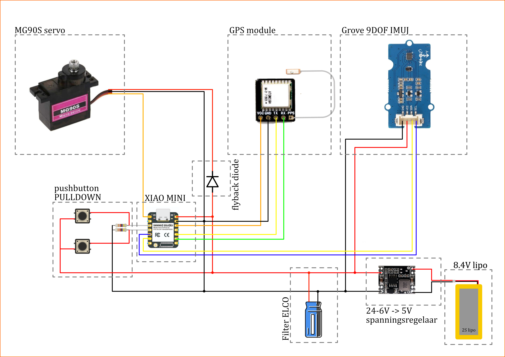
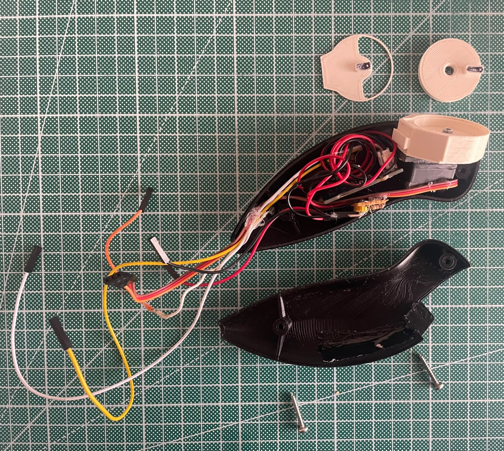

# Bill of Materials (BOM) - Finaal prototype

Dit document bevat de volledige lijst met componenten, specificaties en de geschatte kosten voor de hardware-opstelling van het finaal prototype.
Volgende afbeelding toont de schakeling schematisch weer.

  

## Projectonderdelen
* Seeed Studio XIAO ESP32-C3 (Microcontroller)
* Grove 9DOF IMU
* GPS Module (ATGM336H)
* MG90S Servo motor
* Trilmotor (Vibratiefeedback)
* 2x Mini drukknoppen (NO - Normally Open)
* 2S LiPo Batterij (8.4V)
* Spanningsregelaar (24-6V naar 5V Step-down)
* Passieve componenten: Pulldown-weerstanden, Filter ELCO (condensator) & Flyback diode
* Behuizing (PLA)
* Wrist strap
* 2x M2 10mm + 2x M3 20mm Self tapping screws

  

## BOM Overzichtstabel

| Component | Omschrijving & Specificaties | Leverancier / Link | Prijs (Schatting) |
| :--- | :--- | :--- | :--- |
| **Microcontroller** | Seeed Studio XIAO ESP32-C3 | [TinyTronics](https://www.tinytronics.nl/nl/development-boards/microcontroller-boards/met-wi-fi/seeed-studio-xiao-esp32-c3) | € 5,75 |
| **IMU Sensor** | Grove 9DOF IMU | [Kiwi Electronics](https://www.kiwi-electronics.com/nl/grove-imu-9dof-lcm20600plusak09918-3846?country=BE&srsltid=AfmBOopqmfeYfQyhHcdItZywFxrUNuzILHDj82UwgwsfwIFvtD4FXrsQIfM) | € 12,09 |
| **GPS Module** | ATGM336H GPS Module (met antenne) | [TinyTronics](https://www.tinytronics.nl/nl/communicatie-en-signalen/draadloos/gps/modules/atgm336h-gps-module) | € 10,50 |
| **Servo Motor** | MG90S Micro Servo | [TinyTronics](https://www.tinytronics.nl/nl/mechanica-en-actuatoren/motoren/servomotoren/mg90s-mini-servo) | € 5,00 |
| **Trilmotor** | Mini vibratiemotor (bijv. DFRobot Gravity) | [Open Circuit](https://opencircuit.be/product/gravity-vibration-motor-module-for-arduino) | € 2,20 |
| **Spanningsregelaar** | DC-DC Step Down Buck Converter (bijv. TC-9927140) | [Conrad](https://www.conrad.be/nl/p/tru-components-tc-9927140-spanningsregelaar-1-stuk-s-2481785.html?cq_src=google_ads&cq_cmp=21348122607&cq_term=&cq_plac=&cq_net=x&cq_plt=gp&utm_source=google&utm_medium=cpc&utm_campaign=BE+-+PMAX+-+Nonbrand+-+Villains&utm_id=21348122607&gad_source=1&gad_campaignid=21348133353&gbraid=0AAAAAD8JkRoknCmCrwlujvZLe6cwWFdI5&gclid=Cj0KCQjw3K7RBhDJARIsAKRtP5Rwv-7jlLBSkLa2GNxitcIijUEjs4UDEb8aF0clb987Wu8ryEYVIuEaAlu_EALw_wcB) | € 6,99 |
| **Batterij** | 2S LiPo Batterij (7.4V nominaal, 8.4V max) | [Amazon](https://www.amazon.com.be/-/nl/Zeee-Deans-T-stekker-Evader-Truggy/dp/B08X49GRHT/ref=asc_df_B08X49GRHT?mcid=54775554d2b83b62be6bad5c108c2887&tag=begogshpadd0d-21&linkCode=df0&hvadid=714357251991&hvpos=&hvnetw=g&hvrand=14518491013946232866&hvpone=&hvptwo=&hvqmt=&hvdev=c&hvdvcmdl=&hvlocint=&hvlocphy=9225402&hvtargid=pla-1382360838892&psc=1&language=nl_BE&gad_source=1) | € 22.99 |
| **Knoppen** | 2x Mini NO-drukknop (Pushbutton) | [Amazon](https://www.amazon.nl/-/en/DAOKAI-Miniature-Instantaneous-Electronic-Components/dp/B09WVFHMSV/ref=sr_1_3?dib=eyJ2IjoiMSJ9.hNUR04e8K1hoWUWfhQHMxihg-AlsgaisQEdZVqVhMgJDEsPu_yfjmLOL9p1MKQwtS0lgOcd6yVh_Q0g3NYefIvsdPt6AnY-o0YuRuLue12uHV7p9gv5X9nzmw0bV8C6ulqbWVCdlFoQohKxypQoY8LBJ-p5kEUMDh-Kc7DUhHeNld3j5W-teK0-6BOHfUFlOOAjHXrId5p__6vxxVT9v3wFz0CUWuBgKETyKFlnR9rlb5mOd5jaa19VtVsEuvaIbL_HoHqgdt7xItPvFnNDBpS4JM44YkUIVHfmb-s6SL_g.TkA66XVQnUy5JehZgFHfs52DTdXoEFhJKjVtQItwn4I&dib_tag=se&keywords=arduino%2Bpush%2Bbutton&qid=1781269340&sr=8-3&th=1) | € 6,05 |
| **Kleine Componenten**| Weerstanden (pulldown), Filter ELCO, Flyback diode | [Amazon](https://www.amazon.nl/s?k=elektronica+componenten+assortiment) | € 15,00 |
| **Self Tapping Screws**| 2x M2 10mm, 2x M3 20mm Self tapping screws | [Amazon](https://www.amazon.com.be/-/en/Countersunk-Phillips-Stainless-Equipment-Furniture/dp/B08MVMSDCK/ref=sr_1_6?crid=23LQXLEDNTSKA&dib=eyJ2IjoiMSJ9.J6j1QSsp8TlaT7RzVajkpx8Gb3iDAxsK1kxLBYc8xG0VcMfiZTrBAnjp9b7uNp_cneLrOB0LFMAjcq5obqv7oaip8di4RHubfQ7Gkp_8dmKUtQQHye33235gjkTxteQ1l4t8CBO0Vnn0Poy2sRfDX1Iy9XaPiE_bUxkUsk1Ba6aXsMEMyGRjZ1EMDoNDZ_WaDFT2Y4WKylbykFNxrtkhINJLt8tAiWIAp_NEtKmF2h56RXsYth38-e_z6BVAqZE40T2lan2dlV3rqOldgsd1idTNdVBcuBx__jz9hwvbf5U.Eld2JeHWNOrgSZoCGpQPL9VMV1dOcboktnntPl91PRI&dib_tag=se&keywords=m2%2Bm3screws%2Bx%2B20mm&qid=1781375306&sprefix=m2%2Bm3screws%2Bx%2B20mm%2Caps%2C105&sr=8-6&th=1) | €13.99 |
| **Wrist Strap**| Elastische wrist strap | [Amazon](https://www.amazon.com.be/-/en/Replacement-Controller-Adjustable-Attach-Oculus/dp/B0DRV2NJZK/ref=sr_1_21?crid=188LH1UY4QVKE&dib=eyJ2IjoiMSJ9.V-7ov8kPws0BhIKV2RvxRpz2oedJzbDPgtv97M1CqiIi8jmvPB9MJDeeTytGwXH_44ksI8au73ZIUo8H6BskD7dssFIIiI2HC6BN56OuNcIn33dd6vCGyXspOxLmV1Ckm8UlTmdXGIMIVvgGFNGU6AUQxibY6yQnATrXvFeTly4rRJSCzvIVD39833MYMBswZMHtpqIG8aNb9ezPQC8NuF3dOvYi3CivLv9WwuhVa-kN7O56AsmvV5wZR9qpOqUTcFeX7QEbmuVV1QkiEeKU5zx9iv-xANXW52uiraEkvXI.Gvrpoh1yJ3_odc7s5gS2Du9CqVo9yYL7LlPa1us0Iq8&dib_tag=se&keywords=vr+controller+straps&qid=1781374507&sprefix=vr+controller+straps%2Caps%2C174&sr=8-21) | € 13,99 |
| **PLA**| 2x PLA filament (2 kleuren) *Netto verbruik: 60 gram*  | [Bol.com](https://www.bol.com/be/nl/p/polymaker-polyterra-pla-wit/9300000069648971/?cid=1781370465903-1528389304899&bltgh=be2eda1b-be35-4a18-b862-ac33421d1d20.ProductList_Middle.0.ProductTitle) | € 22,49 per rol |
| **Totaal Bruto** | Bruto aanschafwaarde (inclusief grootverpakkingen en restmateriaal) | | € 159,53 |
| **TOTAAL Netto** | Waarde van het daadwerkelijk verbruikte materiaal | | **€ 86,22** |