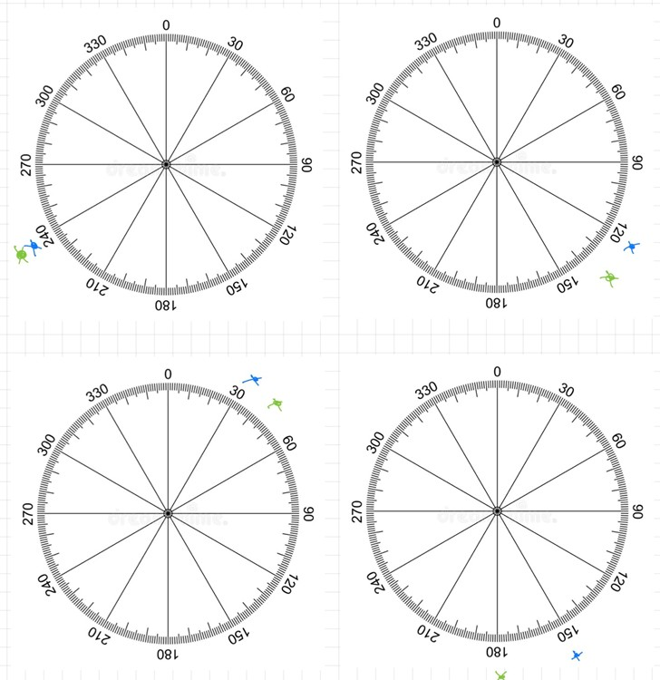

# Develop 1

## Deel 1 (N=5)
Inleiding
In deze eerste ontwikkelingsfase wordt het concept vertaald naar een functionele architectuur. Door het product op te splitsen in verschillende deelaspecten ontstaat meer inzicht in hoe het systeem zal werken en welke onderdelen nodig zijn. Daarnaast worden er testen uitgevoerd samen met de doelgroep om de onderzoeksvragen te beantwoorden.
### Onderzoeksvragen
---

* Kunnen de resultaten uit de studie van Liu et al. (2021) worden benaderd en toegepast binnen het concept?

* Geeft het wegwijzerconcept voldoende zekerheid aan de gebruikers?

* Welke soorten informatie kunnen via trilsignalen aan de gebruiker worden overgebracht?

### Scenario’s
---
In de definitionfase werd ervoor gekozen het product te ontwikkelen voor minder zelfredzame blinden, met als doel hen te helpen bij het aanleren en onderhouden van trajecten. Tijdens de developfase kwam een voorbeeldscenario naar voren dat de inzetbaarheid van het product aantoont.
Zo is Dirk bijvoorbeeld niet in staat om een bepaald traject van buiten te leren. Het traject is namelijk niet voldoende aangepast voor blinden en bevat enkele open ruimtes waar geen duidelijke referentiepunten aanwezig zijn. In zulke situaties kan de wegwijzer extra ondersteuning en oriëntatie bieden tijdens het volgen van een route. Het ondersteunen van gebruikers zoals Dirk bij het afleggen van zulke trajecten vormt een belangrijke doelstelling van het project.
### Architectuur
--- 
Het systeem wordt opgesplitst in twee grote onderdelen: de recordfase en de playfase. Voor beide fases werd een MVP gedefinieerd.
#### Recordfase

* Het toestel kan een traject opnemen terwijl de gebruiker het traject aanleert.

* Het traject kan op een bepaalde manier worden opgeslagen.

#### Playfase

* De gebruiker kan een opgeslagen traject ophalen.

* Het toestel begeleidt de gebruiker doorheen het traject.

In het schema worden de verschillende fases en mogelijke manieren waarop deze kunnen werken in kaart gebracht. 

  

### Interactive prototypen
---
De focus lag in deze fase bij het uitwerken van de wijzer. Hierbij werd vertrokken van het prototype uit de vorige fase. Daaruit ontstonden zes verschillende varianten. Deze werden eerst intern geëvalueerd en vervolgens herwerkt en samengevoegd in een testopstelling waarmee we naar onze doelgroep trokken. Deze opstelling wordt gestuurd aan de hand van een RC-controller.

  

### User testing
---
Voor de testen werd een protocol en rapport opgesteld. Deze zijn hier te lezen.
* [protocol](<../reports and protocols/protocol_Deelopdracht 3 develop 1.pdf>)
* [rapport](<../reports and protocols/Verslag_Deelopdracht 3 develop 1.pdf>)
### Doel van de testen
Drie deelonderzoeken werden uitgevoerd met vijf visueel beperkte respondenten (variërend van volledig blind tot restvisus) om:

* 	De duidelijkste manier van tactiele richtingsaansturing te bepalen (cirkeltest).

* Het beste prototype te testen in een realistische wandelcontext (trajectaanduiding).

* De verstaanbaarheid van trilsignalen als feedback te evalueren.

### Test 1 – Cirkeltest (richtingsnauwkeurigheid)

  
  

#### Opzet
Proefpersonen stonden in het midden van een cirkel (ingedeeld in sectoren van 30°). Drie prototypes (driehoek, draaiwijzer, schijf met balk) werden draadloos aangestuurd. De gebruiker voelde de stand, draaide zich naar de vermeende richting en wees met een witte stok. De afwijking werd geregistreerd.

#### Resultaten
*  De test was waardevol voor inzicht in leercurve en gebruiksgemak, maar te onnauwkeurig voor harde conclusies binnen een marge van 30°.
*  Er was geen eenduidige winnaar: de voorkeuren waren sterk individueel bepaald.
*  De testpersonen overcompenseerden hun kijkrichting wanneer de pijl van richting veranderde stilstond. De pijl die terugkeert naar 0 bij een correcte richting wordt verkeerd geïnterpreteerd.

### Test 2 – Trajectaanduiding (wandeltest)
#### Opzet
Met de beste prototypes (driehoek en draaiwijzer) werd een wandelparcours met bochten en rechte stukken afgelegd. Observaties richtten zich op interactie, verstaanbaarheid, bochtengedrag en zelfzekerheid.
#### Resultaten

* Driehoek (3/5 voorkeur): functioneerde goed, maar er was behoefte aan een duidelijk referentiepunt (tijdelijk opgelost met tape).

* Draaiwijzer (2/5 voorkeur): werd intuïtief gebruikt, maar het verschil tussen het draaiend deel en het referentiepunt moet duidelijker worden aangegeven.

* Houding: 3/5 hielden het prototype correct vast; twee hielden het omgekeerd (pijl naar de grond), wat wijst op nood aan een ergonomische vormgeving.

* Eén respondent met Parkinson gebruikte haar wijsvinger om de pijl af te tasten in plaats van de duim.

* Kleine bijsturingen werden beter geïnterpreteerd dan grote.

Tijdens een van de testen werd volgende opmerking gegeven:
>Chris: "Kom maar eens mee naar het Citadelpark, ik vind daar toch nooit mijn weg terug".

### Test 3 – Vibratiefeedback
#### Opzet
Tijdens de wandeling werden trilsignalen gegeven met vaste betekenissen (start, herkenningspunt, waarschuwing, stop). Reactietijd en interpretatiefouten werden genoteerd.
#### Resultaten
•	Eenvoudige signalen (lange trilling voor start/stop) werden goed begrepen.

•	Complexere patronen (zoals aantal pulsen) zorgden voor verwarring en fouten.

---
### Design requirements

ID   |                                                                                                                      | Fase       |
|------|--------------------------------------------------------------------------------------------------------------------------|------------|
| 2.11 | De tactiele richtingaanwijzer bevindt zich op een locatie die een neutrale, ontspannen polshouding toelaat tijdens het wandelen | Develop 1  |
| 3.5  | Het toestel is accuraat genoeg om de gebruiker op een veilig pad te houden en te begeleiden naar herkenningspunten       | Develop 1  |
| 1.7  | De gebruiker moet bevestiging krijgen wanneer hij correct georiënteerd is                                                | Develop 1  |
| 4.2  | Het wijzersysteem bevat een duidelijk nulpunt of referentie                                                             | Develop 1  |
| 4.3  | De trilpatronen volgen de bestaande en vertrouwde tactiele semantiek van blindengeleidetegels                          | Develop 1  |

--- 

###  Bronnen
Liu, G., Yu, T., Yu, C., Xu, H., Xu, S., Yang, C., Wang, F., Mi, H., & Shi, Y., Tactile Compass: Enabling Visually Impaired People to Follow a Path with Continuous Directional Feedback, CHI Conference on Human Factors in Computing Systems, 2021. https://doi.org/10.1145/3411764.3445644

