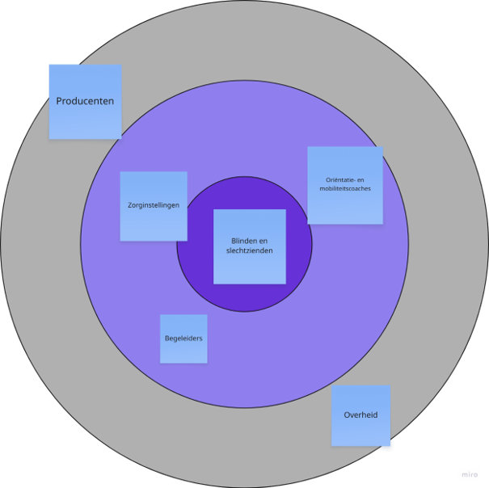
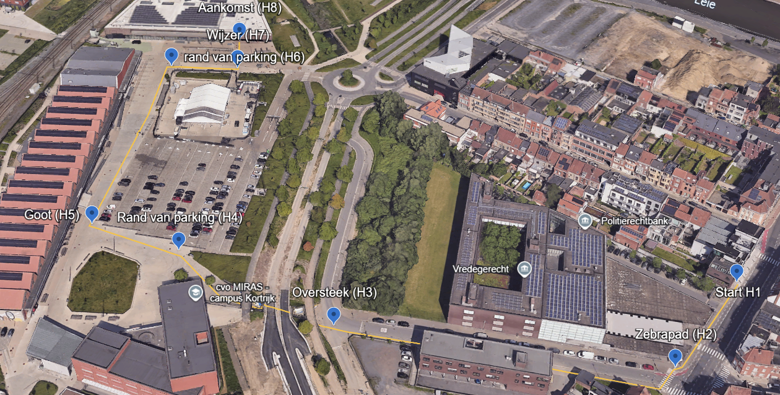
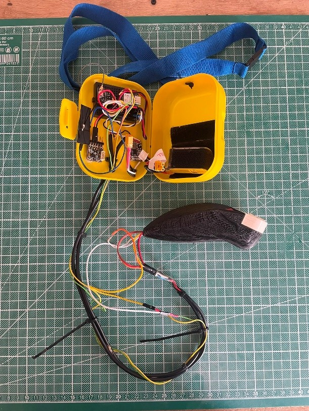
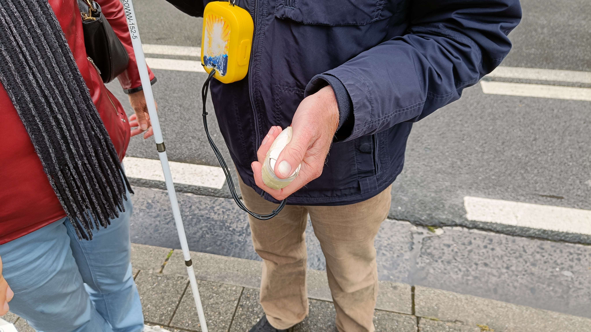

# Develop 1 (N = 5)

In deze eerste ontwikkelingsfase wordt het concept vertaald naar een functionele architectuur. Door het product op te splitsen in verschillende deelaspecten ontstaat meer inzicht in hoe het systeem zal werken en welke onderdelen nodig zijn. Daarnaast worden testen uitgevoerd met de doelgroep om de onderzoeksvragen, gebaseerd op de design requirements, te beantwoorden.

## Architectuur

Het systeem wordt opgesplitst in twee grote onderdelen: de **recordfase** en de **playfase**. Voor beide fases werd een Minimum Viable Product (MVP) gedefinieerd.

### Recordfase

- Het toestel kan een traject opnemen terwijl de gebruiker het traject aanleert.
- Het traject kan worden opgeslagen.

### Playfase

- De gebruiker kan een opgeslagen traject ophalen.
- Het toestel begeleidt de gebruiker doorheen het traject.

Onderstaand schema toont de verschillende fases en hun onderlinge relaties.

  
   
  <em>Systeemarchitectuur en user flow van het systeem met record- en playfase.</em>

## Onderzoeksvragen

De onderzoeksvragen dienen om de design requirements te vertalen naar concrete productspecificaties.

| Requirement | Onderzoeksvraag |
|------------|----------------|
| **D3.1** Het systeem geeft continu de huidige looprichting tactiel weer. | Wat betekent de studie van Liu et al. (2021) voor het concept? |
| **D3.4** De gebruiker legt minder bekende trajecten af met zelfvertrouwen dankzij het systeem. | Wat is er nodig zodat het wijzerconcept voldoende zekerheid biedt aan de gebruiker? |
| **D5.1** De UI is volledig bedienbaar zonder visuele informatie. | Welke elementen uit de systeemarchitectuur kunnen via trilsignalen worden gecommuniceerd? |

Drie deelonderzoeken werden uitgevoerd met vijf visueel beperkte respondenten, variërend van volledig blind tot personen met restvisus.

  
   
  <em>Bevinding van testen in de architectuur.</em>

## User Testing

Voor de testen werden een protocol en een rapport opgesteld.

- [Protocol](<../reports and protocols/protocol_Deelopdracht 3 develop 1.pdf>)
- [Rapport](<../reports and protocols/Verslag_Deelopdracht 3 develop 1.pdf>)

## Interactieve prototypes

Om Vanuit het prototype uit de vorige fase werden zes varianten ontwikkeld. Na een interne evaluatie werden deze herwerkt en samengevoegd tot een testopstelling die werd aangestuurd met een RC-controller.

  
   
  <em>Overzicht van de ontwikkelde develop 1 prototypes.</em>

## Test 1 – Cirkeltest

  
  
   
  <em>Cirkeltest in actie</em>

### Opzet

De proefpersonen stonden in het midden van een cirkel die was onderverdeeld in sectoren van 30°. Drie prototypes (driehoek, draaiwijzer en schijf met balk) werden draadloos aangestuurd. De gebruiker voelde de stand van de wijzer, draaide zich naar de vermeende richting en wees met een witte stok. De afwijking ten opzichte van de doelrichting werd geregistreerd.

### Resultaten

#### Referentie en positie

Bij versie C trad een omgekeerd effect op. De pijl wees naar links, terwijl de testpersoon naar rechts draaide. Drie van de vijf testpersonen interpreteerden de stilstaande pijl als richtingaanwijzer en het draaiende element als referentie.

Mark, die nog over restvisus beschikt, scoorde goed met versie C. Dit was de enige versie met voldoende visueel contrast.

Bij versie B werden bewegend element en referentiepunt omgewisseld. Dit leverde geen interpretatieproblemen op.

Bij versie A ontbrak een vast referentiepunt, wat resulteerde in minder nauwkeurige positionering.

#### Zelfzekerheid

Versie A gaf gebruikers het meeste vertrouwen, maar leidde tegelijk tot de meeste fouten. Een grotere pijl lijkt dus meer vertrouwen te creëren, ongeacht de daadwerkelijke nauwkeurigheid.

##### Belangrijkste bevindingen

- Een referentiepunt is noodzakelijk.
- Het referentiepunt bevindt zich best achter de pijl.
- Een grotere pijl wordt duidelijker ervaren.
- Extra contrast verhoogt de bruikbaarheid voor slechtzienden.

#### Evaluatie van de test

De cirkeltest leverde waardevolle inzichten op voor de leercurve en het gebruikersvertrouwen. De opstelling was echter niet nauwkeurig genoeg om harde uitspraken te doen over een richtingsnauwkeurigheid binnen 30°.

##### Beperkingen

- **Onderzoekersbias:** timing van metingen was niet altijd consistent.
- **Resolutie:** de positie van deelnemers kon niet altijd exact worden afgelezen.

---

## Test 2 – Trajectaanduiding

### Opzet

Met de twee best presterende prototypes (driehoek en draaiwijzer) werd een wandelparcours met rechte stukken en bochten afgelegd.

  
   
  <em>Wandelparcours met obstakels gebruikt in de trajectaanduidingstest.</em>

### Resultaten

- **Driehoek (3/5 voorkeur):** functioneerde goed, maar er was behoefte aan een duidelijk referentiepunt. Dit werd tijdens de test tijdelijk opgelost met tape.
- **Draaiwijzer (2/5 voorkeur):** werd intuïtief gebruikt, maar het onderscheid tussen het draaiende deel en het referentiepunt moet duidelijker worden aangegeven.
- **Houding:** 3 van de 5 deelnemers hielden het prototype correct vast. Twee deelnemers hielden het omgekeerd (met de pijl naar beneden gericht), wat wijst op de noodzaak van een meer ergonomische vormgeving.
- **Parkinson:** één respondent met Parkinson gebruikte haar wijsvinger om de pijl af te tasten in plaats van haar duim.
- **Richtingscorrecties:** kleine richtingsaanpassingen werden beter geïnterpreteerd dan grote richtingsveranderingen.

#### Opmerking van een deelnemer

> *"Kom maar eens mee naar het Citadelpark, dan vind ik misschien wel mijn weg terug."* — Chris

Deze uitspraak suggereert dat de deelnemer vertrouwen had in het toestel en de potentie ervan zag voor gebruik in een reële navigatiecontext.

---

## Test 3 – Vibratiefeedback

### Opzet

Tijdens de wandeling werden trilsignalen gegeven met vaste betekenissen (start, herkenningspunt, waarschuwing, stop). Reactietijd en interpretatiefouten werden genoteerd.

  
   
  <em>Overzicht van de gebruikte trilconventies tijdens de vibratiefeedbacktest.</em>

### Resultaten

- Lange trillingen voor start en stop werden correct geïnterpreteerd.
- Complexere patronen veroorzaakten verwarring en interpretatiefouten.

#### Belangrijkste bevinding

Complexere signalen vereisen bijkomende verduidelijking of training.

---

## Nieuwe Design Requirements

| ID   | Design Requirement |
|------|--------------------|
| D5.6 | De tactiele richtingaanwijzer bevindt zich op een locatie die een neutrale en ontspannen polshouding toelaat tijdens het wandelen. |
| D3.5 | Het toestel is accuraat genoeg om de gebruiker op een veilig pad te houden en te begeleiden naar herkenningspunten. |
| D3.2 | De gebruiker krijgt bevestiging wanneer hij correct georiënteerd is. |
| D3.3 | Het wijzersysteem bevat een duidelijk nulpunt of referentiepunt. |
| D5.4 | De trilpatronen volgen de bestaande en vertrouwde tactiele semantiek van blindengeleidetegels. |

---

# Develop 2 (N = 5)

## Inleiding

In deze fase worden zowel de ergonomie van de controller als de nodige knoppen en hun plaatsing op het product onderzocht.  
Op basis van vooronderzoek en bestaande studies werden verschillende prototypes ontwikkeld. Deze prototypes werden vervolgens getest bij de doelgroep.

---

## Onderzoeksvragen

De onderzoeksvragen zijn opnieuw gebaseerd op de design requirements:

| Requirement | Onderzoeksvraag |
|------------|----------------|
| **D5.5** Het systeem is bruikbaar na een enkele uitlegsessie van ≤ 20 minuten. | Hoe maken we de interacties ergonomisch, met nadruk op een lage mentale belasting? |
| **D5.6** De tactiele richtingaanwijzer bevindt zich op een locatie die een neutrale en ontspannen polshouding toelaat tijdens het wandelen. | Hoe kan de vorm van het product de houding van de gebruiker sturen? |
| **D5.1** De UI is volledig bedienbaar zonder visuele informatie. | Welke knoppen zijn geschikt en bruikbaar voor de doelgroep?   Wat is de beste plaatsing van deze knoppen op het product? |

  
   
  <em>Bevinding van testen in de architectuur.</em>

---

## Vooronderzoek ergonomie en verloop

Om het ontwerpproces te ondersteunen, werden de prototypes gebaseerd op bestaande producten en onderzoek. Het volledige ergonomie onderzoek is hier te lezen: 

- [Ergonomie](<../reports and protocols/onderzoek_develop_2.pdf>)

### Aanpak

1. Analyse van bestaande producten (benchmark)
2. Mapping van noodzakelijke inputs naar button layouts
3. Onderzoek naar ergonomie van de hand
4. Bepalen van kritische maten
5. Vastleggen van afmetingen via ontwerpstrategie
6. Validatie via kleimodellen
7. Uitwerken van prototypes voor testing

---

## User Testing

De test bestaat uit twee delen die de interactie van de gebruiker met het toestel onderzoeken: een fysieke interactietest rond grip en houding, en een scenario-gebaseerde test waarbij de een deel van de gebruikersflow wordt nagebootst.

### Testopzet

- **Test 1:** In het eerste deel wordt de houding en greep van de gebruiker onderzocht. De testpersonen staan recht en krijgen verschillende prototypes één voor één aangereikt. Ze verkennen de grip intuïtief en rangschikken de prototypes vervolgens van minst naar meest comfortabel, waarbij ze hun keuze toelichten.

- **Test 2:** In het tweede deel wordt een realistisch gebruiksscenario nagebootst. Deelnemers krijgen eerst een korte briefing over het toestel en doorlopen daarna de volledige flow alsof ze op pad gaan: het toestel opbergen, zich voorbereiden met hulpmiddelen, het toestel activeren, een traject selecteren en starten. Dit loopt tot het moment waarop de gebruiker effectief “vertrekt”.

  
   
  <em>Develop 2 greep analyse.</em>

Voor de testen werden een protocol en rapport opgesteld:

- [Protocol](<../reports and protocols/protocol_develop_2.pdf>)
- [Rapport](<../reports and protocols/Rapport_develop_2.pdf>)

---

## Resultaten

### Grip en ergonomie
Prototypes 2 en 5 voldeden aan D5.6 door een duidelijke griporiëntatie. Prototype 2 werd soms omgekeerd vastgenomen, terwijl de asymmetrische versie (3) verwarring veroorzaakte en onvoldoende rekening hield met wisselend handgebruik.

Hoewel gebruikers vaak getraind zijn om de witte stok in de rechterhand te gebruiken, blijkt dit in de praktijk geen vaste regel: ze wisselen regelmatig van hand afhankelijk van de situatie.

#### Belangrijk inzicht
- Het toestel moet bruikbaar zijn voor zowel links- als rechtshandigen.

---

### Opbergen en draagbaarheid

Gebruikers plaatsen het toestel bij hun witte stock, deze staat meestal ergens aan de voordeur opgeborgen. Qua draagbaarheid is compactheid belangrijk; het past doorgaans in jaszak of handtas. De asymmetrische vorm van versie 3 verminderde de draagbaarheid en toonde aan dat niet alleen grootte, maar ook vorm bepalend is voor opbergen.

#### Belangrijk inzicht
- Gebruikers willen een compact toestel dat hen niet verhindert.
- Het toestel heeft de mogelijkheid om op een vaste plaats opgeslagen te worden.

---

### App vs. geïntegreerde interactie

- App werkt voor selectie, maar creëert onzekerheid na keuze.
- Gebruikers vergaten soms het toestel te activeren.

#### Belangrijk inzicht
- Wisselen tussen toestel verhoogt cognitieve belasting.

---

### Multitasking

- Combinatie van gsm + toestel + hulpmiddelen gaf problemen.
- Gebruikers verloren overzicht.

> *"Een deelnemer vroeg tijdens de test of we even het prototype wouden vasthouden terwijl zij haar ander gerief verzamelde"*.

#### Conclusie
- Voorkeur om alle interacties in een toestel te integreren.

---

### Interactie op het toestel

We zien duidelijk dat minder knoppen overeenkomen met minder fouten.  
Deze observatie sluit aan bij wet van Hick.

- Beste variant:
  - 1 aan/uit knop
  - 1 selectie/bevestiging knop

Deze voldoet aan **D5.1 en D5.2**.

#### Belangrijk inzicht
- Interactie moet lineair en volgtijdelijk zijn:
  1. Toestel aan
  2. Traject selecteren
  3. Traject starten

---

### Tactiele herkenbaarheid van knoppen

- Knoppen waren niet altijd direct herkenbaar.
- Soms werden andere onderdelen als knop geïnterpreteerd.

#### Conclusie
- Tactiele hiërarchie moet sterker worden.

---

### Rotary encoder

- Niet geschikt:
  - Te snel inputgedrag
  - Te groot
  - Haakt bij opbergen

---

### Perceived quality

Deelnemers gingen opmerkelijk voorzichtig om met de prototypes.

#### Conclusie
- Eindproduct moet robuust en kwalitatief aanvoelen.

## Nieuwe Design Requirements

| ID   | Design Requirement |
|------|--------------------|
| D3.4 | Het ontwerp communiceert visueel en tactiel een gevoel van stevigheid en duurzaamheid. |
| D5.7 | Het toestel past in een broekzak. |
| D5.8 | De gebruiker heeft vertrouwen dat het toestel niet uit de hand kan vallen tijdens gebruik. |

# Develop 3 (N = 2)

## Inleinding 
Dit is de eindfase van dit ontwerpproces. In deze fase wordt de CMF onderzocht en toegepast op het product. Daarnaast wordt ook kort eens gekeken naar de marktplaats van SHERPA en plaatsing binnen de maatschappij. Als laatste wordt ook nog een finale test uitgevoerd om te kijken hoe het product in de echte wereld presteert. Het tweede deel is een overkoepelende praktijktest waarbij het volledige systeem in een realistische omgeving wordt geëvalueerd.

- [Protocol Develop 3](<../reports and protocols/protocol_develop_3.pdf>)
- [Rapport Develop 3](<../reports and protocols/Rapport_develop_3.pdf>)

### Deel 1 CMF onderzoek 
Het voledige onderzoek is te lezen in het protocol en rapport van deze fase.

##### Doel van het onderzoek

CMF (Color, Material, Finish) en marktpositie: onderzoeken welke kleuren, materialen en afwerkingen het meest geschikt zijn en hoe potentiële gebruikers het product in de markt zien.

  
   
  <em>CMF refentieproducten.</em>

Voor het CMF-onderzoek kregen respondenten verschillende referentieproducten (zoals scheerapparaten, controllers en tandenborstels) in willekeurige volgorde in handen. Ze werden bevraagd over onder andere:

* comfort en grip
* materiaalgevoel
* herkenbaarheid van knoppen
* kleurcontrast
* geschiktheid voor langdurig gebruik
* Belangrijkste bevindingen

Uit de interviews kwamen de volgende conclusies naar voren:

Vormgeving: de vorm moet intuïtief aangeven hoe het product vastgehouden moet worden. De richting van de wijzer moet duidelijk zijn en knoppen moeten gemakkelijk voelbaar en herkenbaar zijn door reliëf of een afwijkende vorm.
Kleurgebruik: kleur moet een functionele rol spelen, bijvoorbeeld om knoppen beter zichtbaar te maken en het product gemakkelijker terug te vinden voor slechtziende gebruikers. Hoog contrast wordt als belangrijk beschouwd.
Materiaal: omdat het product buiten gebruikt wordt en schokken moet kunnen weerstaan, zijn sterke en impactbestendige materialen gewenst. Een combinatie van een harde kern met een rubberachtige buitenlaag werd door respondenten als comfortabel en praktisch ervaren.
Afwerking: een satijnen afwerking kreeg de voorkeur. Glossy oppervlakken werden als glad ervaren en matte oppervlakken zouden sneller vuil worden. Gladde knoppen werden positief beoordeeld.

##### Marktpositie en maatschappij

De respondenten zagen potentieel in SHERPA en zouden overwegen het te kopen als het een afgewerkt product was. Een mogelijke terugbetaling als medisch hulpmiddel zou de aantrekkelijkheid verhogen, terwijl een verplicht abonnement voor updates eerder negatief werd beoordeeld. Daarnaast kwam de vraag naar voren wie aansprakelijk is bij ongevallen tijdens het gebruik, dit vraagt verder juridisch onderzoek .

  
   
  <em>Stakeholderkaart </em>

**Producenten**
Profiteren van het terugbetalingssysteem voor erkende hulpmiddelen, wat hun marge vergroot en de drempel voor de gebruiker verlaagt.

**Oriëntatie- en mobiliteitstrainers**
Integreren het product in hun trainingsprogramma's en spelen een sleutelrol bij het opnemen van trajecten en de begeleiding op maat.

**Zorginstellingen**
Staan in voor verkoop, advies en nazorg. Als vertrouwd aanspreekpunt voor de doelgroep zijn zij een belangrijke schakel in de distributie.

**Begeleiders en mantelzorgers**
Ondersteunen de gebruiker bij het opnemen van trajecten en de dagelijkse werking van het systeem.

**Overheid**
Verantwoordelijk voor toegankelijke infrastructuur, maar in de praktijk zijn er nog veel tekortkomingen zoals ontbrekende geleidelijnen, slecht onderhouden voetpaden en inconsistent straatmeubilair. Betere infrastructuur vergroot de effectiviteit van SHERPA aanzienlijk.

---

###  Deel 2 - Overkoepelende test

### Testomgeving en setup

Twee trajecten werden geselecteerd op basis van situaties die tijdens de definitiefase door de deelnemers werden aangehaald. Beide bevatten uitdagingen die vaak voorkomen bij zelfstandig navigeren, zoals het oversteken van open ruimtes, het herkennen van oriëntatiepunten en het vinden van zebrapaden.

**Traject Dirk — Kortrijk**
Dirk gaf aan dat hij graag zelfstandig naar het zwembad zou gaan. Het traject tussen bushalte Kortrijk Weide en de ingang van het zwembad vormt een uitdaging door open ruimtes en zebrapaden. Herkenningspunten zijn onder andere paaltjes, een tunnelwand, goten en betonnen randen.

  
   
  <em>Traject Kortrijk Weide Lago</em>

**Traject Chris — Gullegem**
Chris beschreef een traject tussen Gent-Sint-Pieters en het MSK. Om praktische redenen werd een vergelijkbaar traject uitgewerkt in Gullegem, met herkenningspunten zoals stoepranden, riooldeksels, verlaagde boordstenen, grasranden en straatmeubilair.

---

### Prototype

Het werkende prototype bestond uit de volgende componenten:

- Een tactiele wegwijzer
- Een controledoos gedragen rond de nek
- Een webdashboard voor trajectmonitoring
- GPS-besturing met mogelijkheid tot manuele overname

Het systeem gaf trilsignalen bij het bereiken van herkenningspunten. Gesproken instructies werden tijdens de test door een begeleider gegeven.

  
   
  <em>Gebruikt prototype finale test</em>

---

### Testverloop

Voor beide trajecten werd hetzelfde scenario gevolgd:

1. De deelnemer wordt naar het startpunt gebracht.
2. Het prototype wordt aangebracht en kort toegelicht.
3. De deelnemer start het traject.
4. De wegwijzer geeft richtingsinformatie.
5. Op vooraf bepaalde herkenningspunten worden trilsignalen en gesproken instructies gegeven.
6. Observaties worden geregistreerd gedurende het volledige traject.

---

### Resultaten

#### Wegwijzing

Op het eerste traject werkte het GPS-prototype aanvankelijk goed en werden de eerste herkenningspunten aantoonbaar bereikt. Na verloop van tijd begon de GPS te driften, waardoor we overschakelden naar manuele besturing. Hiermee werden de overige herkenningspunten zonder problemen bereikt. Eén interventie was nog nodig ter hoogte van herkenningspunt 3, waar een auto de deelnemer afleiding veroorzaakte.

Bij de tweede test werkte de GPS van bij het begin niet correct en schakelden we onmiddellijk over naar manuele sturing. Het traject in Gullegem verliep vlotter door het grotere aantal volglijnen. De deelnemer concentreerde zich vooral op het toestel op stukken zonder volglijn.

#### Aangeleerde gewoontes

Deelnemers verkozen op momenten hun eigen intuïtie boven de aanwijzingen van de wijzer. Zo volgden ze de stoeprand in plaats van de instructie om rechtdoor te gaan, en lieten ze een herkenningspunt los toen de wijzer haaks op de stoeprand wees. Dit bevestigt dat het toestel de aangeleerde mobiliteitstechnieken — zoals volglijnen en herkenningspunten — moet ondersteunen en niet doorkruisen.

#### Spraakinstructies

Spraakinstructies gaven duidelijk het meeste vertrouwen, meer dan de wijzer alleen. Op stukken met een volgbare route werd de wijzer nauwelijks gebruikt. Tussen H5, H6 en H7, waar geen volglijn beschikbaar was, schakelde de deelnemer volledig over op het wijzersysteem. Hier was een korte aarzeling zichtbaar, waarna de deelnemer de aanwijzingen van het systeem volgde.

#### Trilsignalen

De trilsignalen waren moeilijk te observeren in hun effect. Ongeacht het signaal stopte de gebruiker steeds en wachtte op de gesproken instructie. Tijdens de debrief gaven deelnemers aan dat ze de aard van het signaal niet actief interpreteren — enkel de aanwezigheid ervan volstaat als attentietrigger. Dit suggereert dat één uniform attentiesignaal voldoende is.

#### Trajectvoorbereiding

De trajecten werden uitgestippeld op basis van Google Earth en lokale kennis. De GPS-problemen roepen de vraag op of het verschil tussen Google Earth en de werkelijke situatie ter plaatse hieraan bijdraagt. Het effectief afwandelen van een traject samen met een begeleider blijkt noodzakelijk om accurate en actuele trajecten op te bouwen.

#### Debrief

  
   
  <em>Debrief</em>

Een deelnemer gaf spontaan aan geïnteresseerd te zijn in het toestel voor dagelijks gebruik. Een andere deelnemer merkte op dat de wijzer soms onduidelijk bewoog, wat te wijten is aan inconsistente manuele besturing door de onderzoeker.

---

### Succes metrics

In welke mate zijn we erin geslaagd om de vooropgestelde succes metrics te halen? Hieronder een overzicht:

| ID | Requirement | Meetcriterium | Traject 1 (Dirk) | Traject 2 (Chris) | Resultaat |
|----|-------------|---------------|-------------------|-------------------|-----------|
| D1.1 | Het systeem begeleidt de gebruiker doorheen een traject zodat elk herkenningspunt aantoonbaar bereikt wordt. | ≥ 100% van de herkenningspunten correct bereikt (observatie per punt: ja/nee). | H2 en H3 niet bereikt | H1 t.e.m. H6 bereikt | ⚠️ Gedeeltelijk |
| D1.2 | Het systeem geeft eenduidige feedback bij correcte richting, foute richting, herkenningspunten en gevaarlijke locaties. | Deelnemer reageert correct op elk feedbacksignaal; ≥ 90% correcte reacties per sessie. | H1 t.e.m. H8 | H1 t.e.m. H6 | ✅ Voldaan |
| D1.3 | De gebruiker toont geen verwarring bij de start van het traject. | Geen observeerbare verwarring (pauze > 10 s, foutieve richting, verbale twijfel) in de eerste 60 s. | Geen verwarring bij start, wel later door aangeleerde gewoontes | Geen verwarring bij start, wel later door aangeleerde gewoontes | ⚠️ Gedeeltelijk |
| D4.1 | Het gebruik van de witte stok wordt niet belemmerd door het product. | 0 obstakelcontacten bij ≥ 3 deelnemers tijdens trajecttest. | ✅ Voldaan | ✅ Voldaan | ✅ Voldaan |
| D5.5 | Het systeem is bruikbaar na een enkele uitlegsessie van ≤ 20 minuten. | Deelnemer voltooit het parcours met ≤ 2 begeleidersinterventies na max. 20 min uitleg. | ❌ Niet voldaan | ✅ Voldaan | ⚠️ Gedeeltelijk |
| D3.4 | De gebruiker legt minder bekende trajecten af met zelfvertrouwen dankzij het systeem. | BERT: Onzeker ←1·2·3·4·5·6·7→ Zelfzeker — drempel: ≥ +2 t.o.v. score zonder toestel. | Zonder: 2 · Met: 5 · Verschil: +3 | Zonder: 4 · Met: 6 · Verschil: +2 | ✅ Voldaan |

### Samenvatting

De GPS-technologie bleek onvoldoende betrouwbaar voor beide trajecten: manuele besturing werkte telkens wel. Spraakinstructies zijn de sterkste vertrouwensgever, de wijzer wordt vooral ingezet waar geen volglijn beschikbaar is. Trilsignalen functioneren puur als attentietrigger en niet als informatiedrager, wat het gebruik van één uniform signaal rechtvaardigt. Voor toekomstige testen is trajectvoorbereiding ter plaatse, samen met een begeleider, een vereiste.