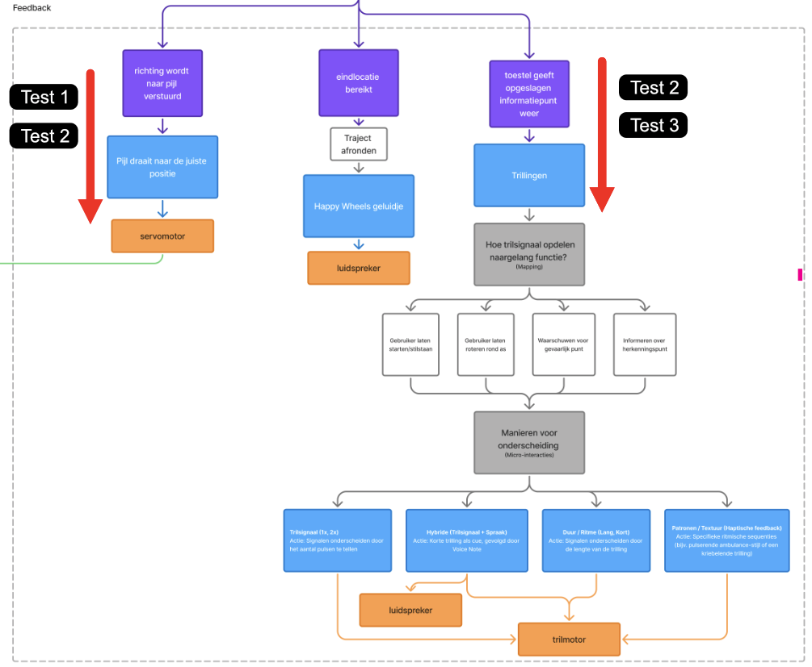
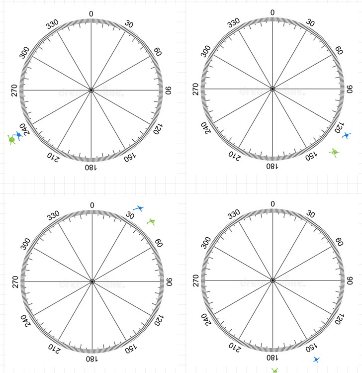
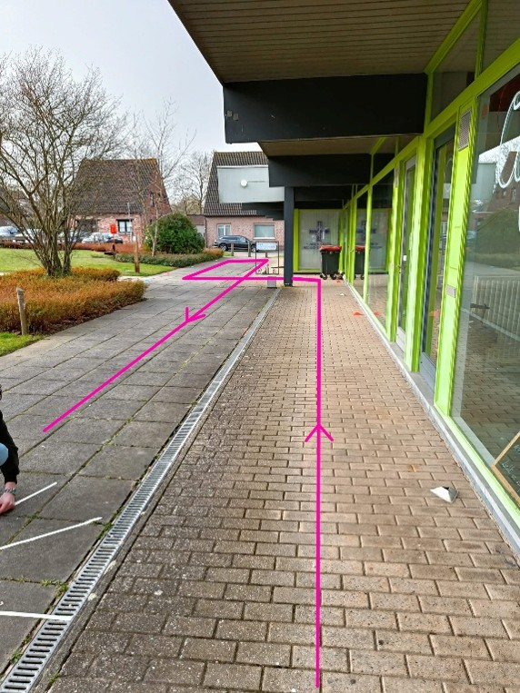
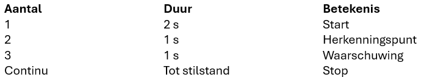
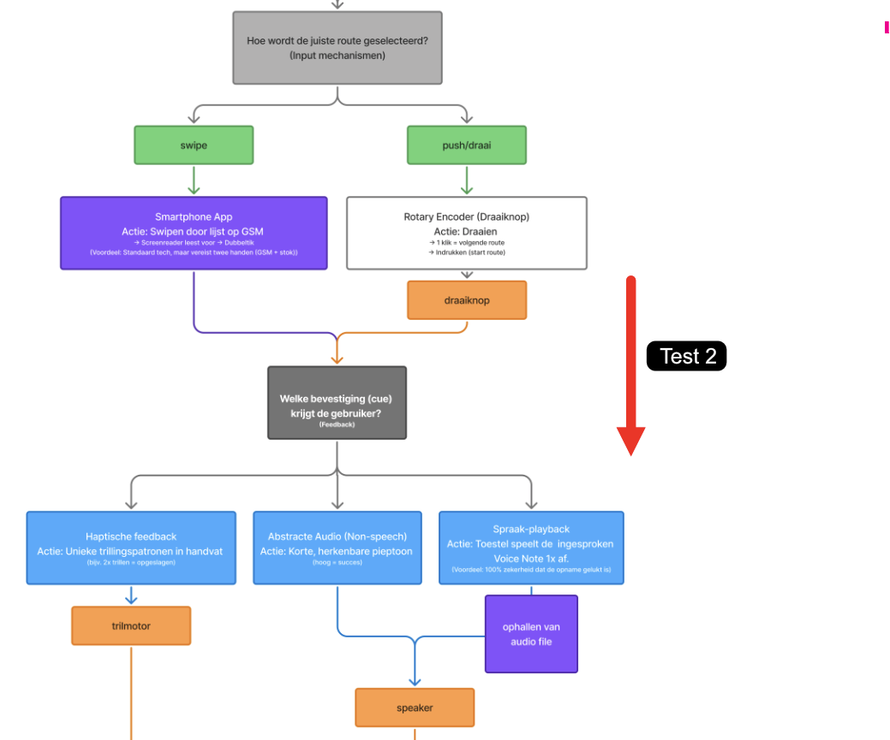
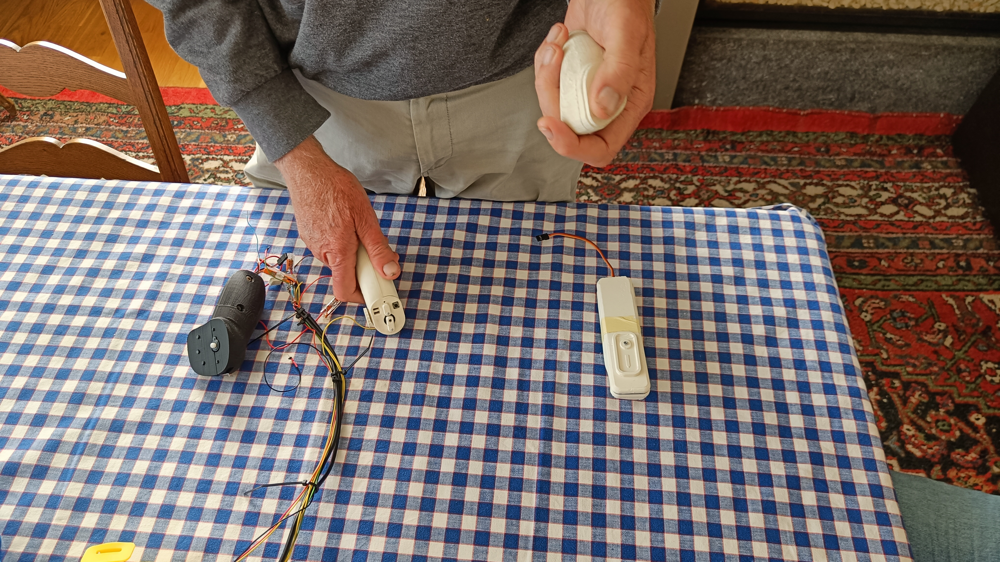
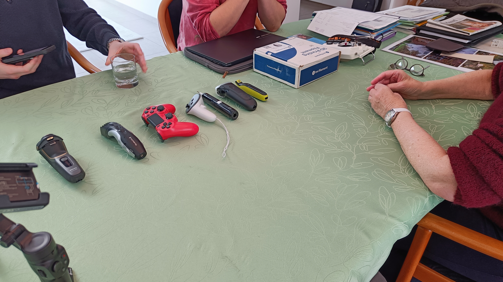

# Develop 1 (N = 5)

In deze eerste ontwikkelingsfase wordt het concept vertaald naar een functionele architectuur. Door het product op te splitsen in verschillende deelaspecten ontstaat meer inzicht in hoe het systeem zal werken en welke onderdelen nodig zijn. Daarnaast worden testen uitgevoerd met de doelgroep om de onderzoeksvragen, gebaseerd op de design requirements, te beantwoorden.

## Architectuur

Het systeem wordt opgesplitst in twee grote onderdelen: de **recordfase** en de **playfase**. Voor beide fases werd een Minimum Viable Product (MVP) gedefinieerd.

### Recordfase

- Het toestel kan een traject opnemen terwijl de gebruiker het traject aanleert.
- Het traject kan worden opgeslagen.

### Playfase

- De gebruiker kan een opgeslagen traject ophalen.
- Het toestel begeleidt de gebruiker doorheen het traject.

Onderstaand schema toont de verschillende fases en hun onderlinge relaties.

  
   
  <em>Systeemarchitectuur en user flow van het systeem met record- en playfase.</em>

## Onderzoeksvragen

De onderzoeksvragen dienen om de design requirements te vertalen naar concrete productspecificaties.

| Requirement | Onderzoeksvraag |
|------------|----------------|
| **D3.1** Het systeem geeft continu de huidige looprichting tactiel weer. | Wat betekent de studie van Liu et al. (2021) voor het concept? |
| **D3.4** De gebruiker legt minder bekende trajecten af met zelfvertrouwen dankzij het systeem. | Wat is er nodig zodat het wijzerconcept voldoende zekerheid biedt aan de gebruiker? |
| **D5.1** De UI is volledig bedienbaar zonder visuele informatie. | Welke elementen uit de systeemarchitectuur kunnen via trilsignalen worden gecommuniceerd? |

Drie deelonderzoeken werden uitgevoerd met vijf visueel beperkte respondenten, variërend van volledig blind tot personen met restvisus.

  
   
  <em>Bevinding van testen in de architectuur.</em>

## User Testing

Voor de testen werden een protocol en een rapport opgesteld.

- [Protocol](<../reports and protocols/protocol_Deelopdracht 3 develop 1.pdf>)
- [Rapport](<../reports and protocols/Verslag_Deelopdracht 3 develop 1.pdf>)

## Interactieve prototypes

Om Vanuit het prototype uit de vorige fase werden zes varianten ontwikkeld. Na een interne evaluatie werden deze herwerkt en samengevoegd tot een testopstelling die werd aangestuurd met een RC-controller.

  
   
  <em>Overzicht van de ontwikkelde develop 1 prototypes.</em>

## Test 1 – Cirkeltest

  
  
   
  <em>Cirkeltest in actie</em>

### Opzet

De proefpersonen stonden in het midden van een cirkel die was onderverdeeld in sectoren van 30°. Drie prototypes (driehoek, draaiwijzer en schijf met balk) werden draadloos aangestuurd. De gebruiker voelde de stand van de wijzer, draaide zich naar de vermeende richting en wees met een witte stok. De afwijking ten opzichte van de doelrichting werd geregistreerd.

### Resultaten

#### Referentie en positie

Bij versie C trad een omgekeerd effect op. De pijl wees naar links, terwijl de testpersoon naar rechts draaide. Drie van de vijf testpersonen interpreteerden de stilstaande pijl als richtingaanwijzer en het draaiende element als referentie.

Mark, die nog over restvisus beschikt, scoorde goed met versie C. Dit was de enige versie met voldoende visueel contrast.

Bij versie B werden bewegend element en referentiepunt omgewisseld. Dit leverde geen interpretatieproblemen op.

Bij versie A ontbrak een vast referentiepunt, wat resulteerde in minder nauwkeurige positionering.

#### Zelfzekerheid

Versie A gaf gebruikers het meeste vertrouwen, maar leidde tegelijk tot de meeste fouten. Een grotere pijl lijkt dus meer vertrouwen te creëren, ongeacht de daadwerkelijke nauwkeurigheid.

##### Belangrijkste bevindingen

- Een referentiepunt is noodzakelijk.
- Het referentiepunt bevindt zich best achter de pijl.
- Een grotere pijl wordt duidelijker ervaren.
- Extra contrast verhoogt de bruikbaarheid voor slechtzienden.

#### Evaluatie van de test

De cirkeltest leverde waardevolle inzichten op voor de leercurve en het gebruikersvertrouwen. De opstelling was echter niet nauwkeurig genoeg om harde uitspraken te doen over een richtingsnauwkeurigheid binnen 30°.

##### Beperkingen

- **Onderzoekersbias:** timing van metingen was niet altijd consistent.
- **Resolutie:** de positie van deelnemers kon niet altijd exact worden afgelezen.

---

## Test 2 – Trajectaanduiding

### Opzet

Met de twee best presterende prototypes (driehoek en draaiwijzer) werd een wandelparcours met rechte stukken en bochten afgelegd.

  
   
  <em>Wandelparcours met obstakels gebruikt in de trajectaanduidingstest.</em>

### Resultaten

- **Driehoek (3/5 voorkeur):** functioneerde goed, maar er was behoefte aan een duidelijk referentiepunt. Dit werd tijdens de test tijdelijk opgelost met tape.
- **Draaiwijzer (2/5 voorkeur):** werd intuïtief gebruikt, maar het onderscheid tussen het draaiende deel en het referentiepunt moet duidelijker worden aangegeven.
- **Houding:** 3 van de 5 deelnemers hielden het prototype correct vast. Twee deelnemers hielden het omgekeerd (met de pijl naar beneden gericht), wat wijst op de noodzaak van een meer ergonomische vormgeving.
- **Parkinson:** één respondent met Parkinson gebruikte haar wijsvinger om de pijl af te tasten in plaats van haar duim.
- **Richtingscorrecties:** kleine richtingsaanpassingen werden beter geïnterpreteerd dan grote richtingsveranderingen.

#### Opmerking van een deelnemer

> *"Kom maar eens mee naar het Citadelpark, dan vind ik misschien wel mijn weg terug."* — Chris

Deze uitspraak suggereert dat de deelnemer vertrouwen had in het toestel en de potentie ervan zag voor gebruik in een reële navigatiecontext.

---

## Test 3 – Vibratiefeedback

### Opzet

Tijdens de wandeling werden trilsignalen gegeven met vaste betekenissen (start, herkenningspunt, waarschuwing, stop). Reactietijd en interpretatiefouten werden genoteerd.

  
   
  <em>Overzicht van de gebruikte trilconventies tijdens de vibratiefeedbacktest.</em>

### Resultaten

- Lange trillingen voor start en stop werden correct geïnterpreteerd.
- Complexere patronen veroorzaakten verwarring en interpretatiefouten.

#### Belangrijkste bevinding

Complexere signalen vereisen bijkomende verduidelijking of training.

---

## Nieuwe Design Requirements

| ID   | Design Requirement |
|------|--------------------|
| D5.6 | De tactiele richtingaanwijzer bevindt zich op een locatie die een neutrale en ontspannen polshouding toelaat tijdens het wandelen. |
| D3.5 | Het toestel is accuraat genoeg om de gebruiker op een veilig pad te houden en te begeleiden naar herkenningspunten. |
| D3.2 | De gebruiker krijgt bevestiging wanneer hij correct georiënteerd is. |
| D3.3 | Het wijzersysteem bevat een duidelijk nulpunt of referentiepunt. |
| D5.4 | De trilpatronen volgen de bestaande en vertrouwde tactiele semantiek van blindengeleidetegels. |

---

# Develop 2 (N = 5)

## Inleiding

In deze fase worden zowel de ergonomie van de controller als de nodige knoppen en hun plaatsing op het product onderzocht.  
Op basis van vooronderzoek en bestaande studies werden verschillende prototypes ontwikkeld. Deze prototypes werden vervolgens getest bij de doelgroep.

---

## Onderzoeksvragen

De onderzoeksvragen zijn opnieuw gebaseerd op de design requirements:

| Requirement | Onderzoeksvraag |
|------------|----------------|
| **D5.5** Het systeem is bruikbaar na een enkele uitlegsessie van ≤ 20 minuten. | Hoe maken we de interacties ergonomisch, met nadruk op een lage mentale belasting? |
| **D5.6** De tactiele richtingaanwijzer bevindt zich op een locatie die een neutrale en ontspannen polshouding toelaat tijdens het wandelen. | Hoe kan de vorm van het product de houding van de gebruiker sturen? |
| **D5.1** De UI is volledig bedienbaar zonder visuele informatie. | Welke knoppen zijn geschikt en bruikbaar voor de doelgroep?   Wat is de beste plaatsing van deze knoppen op het product? |

  
   
  <em>Bevinding van testen in de architectuur.</em>

---

## Vooronderzoek ergonomie en verloop

Om het ontwerpproces te ondersteunen, werden de prototypes gebaseerd op bestaande producten en onderzoek.

### Aanpak

1. Analyse van bestaande producten (benchmark)
2. Mapping van noodzakelijke inputs naar button layouts
3. Onderzoek naar ergonomie van de hand
4. Bepalen van kritische maten
5. Vastleggen van afmetingen via ontwerpstrategie
6. Validatie via kleimodellen
7. Uitwerken van prototypes voor testing

---

## User Testing

De test bestaat uit twee delen die de interactie van de gebruiker met het toestel onderzoeken: een fysieke interactietest rond grip en houding, en een scenario-gebaseerde test waarbij de een deel van de gebruikersflow wordt nagebootst.

### Testopzet

- **Test 1:** In het eerste deel wordt de houding en greep van de gebruiker onderzocht. De testpersonen staan recht en krijgen verschillende prototypes één voor één aangereikt. Ze verkennen de grip intuïtief en rangschikken de prototypes vervolgens van minst naar meest comfortabel, waarbij ze hun keuze toelichten.

- **Test 2:** n het tweede deel wordt een realistisch gebruiksscenario nagebootst. Deelnemers krijgen eerst een korte briefing over het toestel en doorlopen daarna de volledige flow alsof ze op pad gaan: het toestel opbergen, zich voorbereiden met hulpmiddelen, het toestel activeren, een traject selecteren en starten. Dit loopt tot het moment waarop de gebruiker effectief “vertrekt”.

  

Voor de testen werden een protocol en rapport opgesteld:

- [Protocol](<../reports and protocols/protocol_develop_2.pdf>)
- [Rapport](<../reports and protocols/Rapport_develop_2.pdf>)

---

## Resultaten

### Grip en ergonomie
Prototypes 2 en 5 voldeden aan D5.6 door een duidelijke griporiëntatie. Prototype 2 werd soms omgekeerd vastgenomen, terwijl de asymmetrische versie (3) verwarring veroorzaakte en onvoldoende rekening hield met wisselend handgebruik.

Hoewel gebruikers vaak getraind zijn om de witte stok in de rechterhand te gebruiken, blijkt dit in de praktijk geen vaste regel: ze wisselen regelmatig van hand afhankelijk van de situatie.

#### Belangrijk inzicht
- Het toestel moet bruikbaar zijn voor zowel links- als rechtshandigen.

---

### Opbergen en draagbaarheid

Gebruikers plaatsen het toestel bij hun witte stock, deze staat meestal ergens aan de voordeur opgeborgen. Qua draagbaarheid is compactheid belangrijk; het past doorgaans in jaszak of handtas. De asymmetrische vorm van versie 3 verminderde de draagbaarheid en toonde aan dat niet alleen grootte, maar ook vorm bepalend is voor opbergen.

#### Belangrijk inzicht
- Gebruikers willen een compact toestel dat hen niet verhindert.
- Het toestel heeft de mogelijkheid om op een vaste plaats opgeslagen te worden.

---

### App vs. geïntegreerde interactie

- App werkt voor selectie, maar creëert onzekerheid na keuze.
- Gebruikers vergaten soms het toestel te activeren.

#### Belangrijk inzicht
- Wisselen tussen toestel verhoogt cognitieve belasting.

---

### Multitasking

- Combinatie van gsm + toestel + hulpmiddelen gaf problemen.
- Gebruikers verloren overzicht.

> *"Een deelnemer vroeg tijdens de test of we even het prototype wouden vasthouden terwijl zij haar ander gerief verzamelde"*.

#### Conclusie
- Voorkeur om alle interacties in een toestel te integreren.

---

### Interactie op het toestel

We zien duidelijk dat minder knoppen overeenkomen met minder fouten.  
Deze observatie sluit aan bij wet van Hick.

- Beste variant:
  - 1 aan/uit knop
  - 1 selectie/bevestiging knop

Deze voldoet aan **D5.1 en D5.2**.

#### Belangrijk inzicht
- Interactie moet lineair en volgtijdelijk zijn:
  1. Toestel aan
  2. Traject selecteren
  3. Traject starten

---

### Tactiele herkenbaarheid van knoppen

- Knoppen waren niet altijd direct herkenbaar.
- Soms werden andere onderdelen als knop geïnterpreteerd.

#### Conclusie
- Tactiele hiërarchie moet sterker worden.

---

### Rotary encoder

- Niet geschikt:
  - Te snel inputgedrag
  - Te groot
  - Haakt bij opbergen

---

### Perceived quality

Deelnemers gingen opmerkelijk voorzichtig om met de prototypes.

#### Conclusie
- Eindproduct moet robuust en kwalitatief aanvoelen.
# develop3 (N=2)
## inleinding 
Dit is de eindfase van dit ontwerpproces. In deze fase wordt de CMF onderzocht en toegepast op het product. Daarnaast wordt ook kort eens gekeken naar de marktplaats van SHERPA. Als laatste wordt ook nog een finale test uitgevoerd om te kijken hoe het product in de echte wereld presteert.
- [Protocol](<../>)
- [Rapport](<../>)

### CMF onderzoek 
Het voledige onderzoek is te lezen in het protokol en rapport van deze fase.

##### Doel van het onderzoek

CMF (Color, Material, Finish) en marktpositie: onderzoeken welke kleuren, materialen en afwerkingen het meest geschikt zijn en hoe potentiële gebruikers het product in de markt zien.

  

Voor het CMF-onderzoek kregen respondenten verschillende referentieproducten (zoals scheerapparaten, controllers en tandenborstels) in willekeurige volgorde in handen. Ze werden bevraagd over onder andere:

* comfort en grip
* materiaalgevoel
* herkenbaarheid van knoppen
* kleurcontrast
* geschiktheid voor langdurig gebruik
* Belangrijkste bevindingen

Uit de interviews kwamen de volgende conclusies naar voren:

Vormgeving: de vorm moet intuïtief aangeven hoe het product vastgehouden moet worden. De richting van de wijzer moet duidelijk zijn en knoppen moeten gemakkelijk voelbaar en herkenbaar zijn door reliëf of een afwijkende vorm.
Kleurgebruik: kleur moet een functionele rol spelen, bijvoorbeeld om knoppen beter zichtbaar te maken en het product gemakkelijker terug te vinden voor slechtziende gebruikers. Hoog contrast wordt als belangrijk beschouwd.
Materiaal: omdat het product buiten gebruikt wordt en schokken moet kunnen weerstaan, zijn sterke en impactbestendige materialen gewenst. Een combinatie van een harde kern met een rubberachtige buitenlaag werd door respondenten als comfortabel en praktisch ervaren.
Afwerking: een satijnen afwerking kreeg de voorkeur. Glossy oppervlakken werden als glad ervaren en matte oppervlakken zouden sneller vuil worden. Gladde knoppen werden positief beoordeeld.

##### Marktpositie

De respondenten zagen potentieel in SHERPA en zouden overwegen het te kopen als het een afgewerkt product was. Een mogelijke terugbetaling als medisch hulpmiddel zou de aantrekkelijkheid verhogen, terwijl een verplicht abonnement voor updates eerder negatief werd beoordeeld. Daarnaast kwam de vraag naar voren wie aansprakelijk is bij ongevallen tijdens het gebruik, dit vraagt verder juridisch onderzoek .
### finale test
##### Doel van de test

bij de finale test wordt onderzocht hoe goed het product gebruikers ondersteunt tijdens echte wandeltrajecten. De centrale onderzoeksvraag luidt:

Hoe presteert het product in de praktijk?

De nadruk ligt op het testen van het volledige systeem buiten een gecontroleerde laboratoriumomgeving, waar onverwachte situaties en variabelen kunnen optreden.

##### Testopzet

Twee gebruikers liepen een persoonlijk traject dat voor hen relevant was:

Dirk volgde een route van een bushalte naar een zwembad, waarbij vooral zebrapaden en open ruimtes een uitdaging vormden.
Chris testte een alternatief traject in Gullegem, gebaseerd op een eerder gedefinieerde route van Gent-Sint-Pieters naar het MSK.

##### Belangrijkste resultaten
* GPS bleek onvoldoende betrouwbaar

Tijdens de eerste test functioneerde de GPS aanvankelijk correct, maar begon later af te wijken (driften), waardoor de routebegeleiding onnauwkeurig werd. Bij de tweede test werkte de GPS zelfs vanaf het begin niet goed. Daarom werd in beide gevallen overgeschakeld op manuele besturing, waarmee de trajecten succesvol konden worden afgelegd.

* Aangeleerde mobiliteitstechnieken blijven dominant

De deelnemers vertrouwden vaak op hun bestaande oriëntatietechnieken, zoals het volgen van een stoeprand of muur, zelfs wanneer de wijzer een andere richting aangaf. Dit toont aan dat SHERPA bestaande mobiliteitstechnieken moet ondersteunen in plaats van vervangen.

* Gesproken instructies geven het meeste vertrouwen

De verbale aanwijzingen werden als waardevoller ervaren dan de richtingaanwijzer alleen. Op plaatsen zonder duidelijke volglijnen schakelden deelnemers wel over op de wijzer, maar daarbij was vaak eerst een korte periode van twijfel zichtbaar.

* Trilsignalen hoeven mogelijk niet verschillend te zijn

Tijdens de testen reageerden gebruikers niet verschillend op informatieve of waarschuwende trillingen. Ze gebruikten het trilsignaal vooral als teken dat er een gesproken instructie zou volgen. Het rapport suggereert daarom dat één uniform attentiesignaal mogelijk volstaat.

* Goede voorbereiding van routes is essentieel

De onderzoekers concluderen dat trajecten niet alleen digitaal (bijvoorbeeld via Google Earth) mogen worden voorbereid. Om betrouwbare navigatie te garanderen, moeten routes ook fysiek worden gecontroleerd en ingelopen.

##### Feedback van de deelnemers

Tijdens de nabespreking gaven deelnemers aan:

- dat ze weinig aandacht besteedden aan het type trilsignaal en vooral opmerkten of er een trilling was
- interesse te hebben om het toestel daadwerkelijk te gebruiken;
- dat de richtingaanwijzer soms onduidelijk bewoog, mede doordat de handmatige bediening niet altijd volledig consistent was.
##### Evaluatie van de succescriteria

De meeste vooropgestelde doelstellingen werden grotendeels gehaald:

De herkenningspunten werden bereikt wanneer de manuele besturing werd gebruikt.
De gebruiker reageerde correct op de feedback van het systeem.
Er was geen verwarring bij de start van de trajecten.
Het gebruik van de witte stok werd niet belemmerd.
Het tweede traject kon na een korte introductie succesvol worden afgelegd, terwijl het eerste traject door GPS-problemen extra interventies vereiste.
##### Algemene conclusie

De praktijktest toont aan dat het concept van SHERPA veel potentieel heeft, maar dat de huidige GPS-implementatie nog niet betrouwbaar genoeg is voor autonoom gebruik. Gebruikers halen vooral vertrouwen uit gesproken instructies, terwijl de richtingaanwijzer een ondersteunende rol speelt, met name in open ruimtes zonder natuurlijke geleidelijnen. Daarnaast blijkt dat het systeem het beste werkt wanneer het aansluit bij de bestaande mobiliteitstechnieken van slechtziende gebruikers en wanneer routes zorgvuldig vooraf zijn voorbereid.