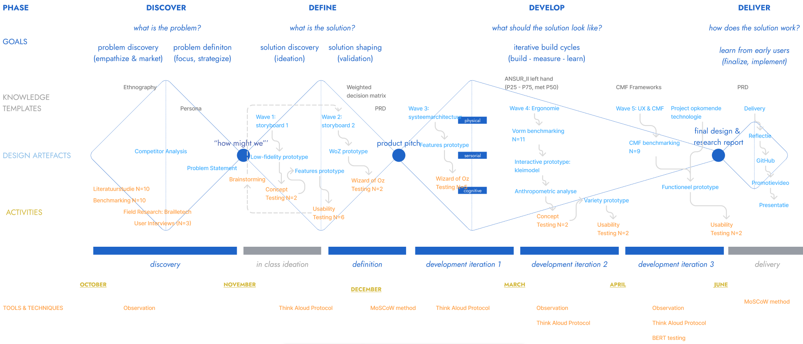

# Methodologie

Dit project volgt de principes van Human-Centered Design binnen het Triple Diamond-model. We doorliepen een iteratief proces, waarbij we via specifieke onderzoeksmethoden continu hebben samengewerkt met de visueel beperkte doelgroep.

  

**Discover: Problem Finding**
Om de leefwereld en navigatienoden van de doelgroep te doorgronden, combineerden we kwantitatieve en kwalitatieve methoden. We voerden literatuurstudies en benchmarking uit (N=16). Dit vulden we aan met etnografisch veldonderzoek (observaties op de Brailletech-beurs en bij een oogatelier) en diepgaande user interviews (N=3). Dit leidde tot de centrale **How Might We-vraag**: 
> *“Hoe kunnen we blinde personen ondersteunen bij het aanleren en onderhouden van trajecten?”*

**Define: Designing the Right Thing**
De ontwerpfase verliep via twee iteratieve *waves*:
* **Wave 1:** We bouwden low-fidelity prototypes van een tactiele pin-matrix. Via *concept testing* (N=2) en *usability testing* (N=6) in outdoormilieus evalueerden we de cognitieve belasting.
* **Wave 2 (Pivot):** Omdat de matrix te complex bleek, maakten we een cruciale pivot naar een fysiek draaibare pijl. Dit concept werd gevalideerd via *Wizard of Oz-testing* (N=2). Via een *weighted decision matrix* kozen we definitief voor dit concept en legden we de functionele eisen vast in een Product Requirement Document (PRD).

**Develop: Iterative Build Cycles**
Het concept werd doorontwikkeld in drie sprints:
* **Develop 1 (N=5):** De tactiele interactie werd geëvalueerd via gerichte *Wizard of Oz-testing*: *cirkeltesten* (richtingsnauwkeurigheid van zes pijlvarianten), *wandeltesten* met obstakels, en *vibratietesten* om haptische signalen af te stemmen.
* **Develop 2 (N=2):** De fysieke ergonomie werd iteratief vormgegeven via antropometrische data en benchmarks (N=11) van eenhandige controllers. Met fysieke kleimodellen en *scenario-testing* valideerden we de grip en button-layout voor gebruik naast de witte stok. De resultaten werden via *variety prototyping* vertaald naar 5 werkende prototypes.
* **Develop 3 (N=2):** De focus verschoof naar CMF en UX Excellence. Via benchmarking (N=9) van bestaande producten voor slechtzienden ontwierpen we de CMF-stragtegie van het product. Vervolgens werden de elektronica van project Opkomende Technologie geïntegreerd in de nieuwe behuizing, wat resulteerde in een autonoom en functioneel prototype.

**Deliver: Finaal Systeem & Validatie**
Tijdens outdoor *usability tests* (N=2) met het autonome, 3D-geprinte prototype valideerden we via directe observatie of de prioritaire eisen (vastgelegd via de *MoSCoW-methode* in het PRD) effectief werden behaald. Tot slot is het functionele eindresultaat, inclusief de werking in een realistische context, visueel vastgelegd in een wervend promotiefilmpje ter presentatie van het project.